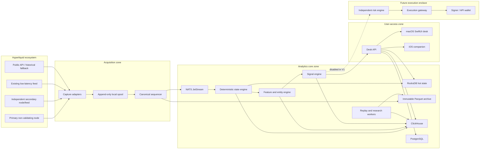
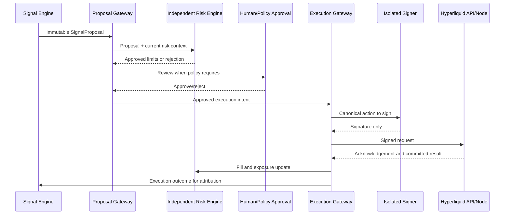

# Hyperliquid Alpha Desk — Production Design Specification

**Document status:** Design draft for owner review  
**Version:** 1.0.0  
**Date:** 2026-07-24  
**Primary product:** Private internal alpha desk  
**Primary implementation languages:** Rust and Swift  
**Deployment model:** Self-hosted and local-only  
**Release intent:** Production-grade private deployment first; open-source platform later  

---

## 1. Executive decision

Build a private, read-only **Hyperliquid Alpha Desk** that reconstructs the complete market and account state from venue-level data, classifies wallets and likely entities point in time, measures whether their actions have historically predictive value after realistic costs, and presents only evidence-backed, execution-aware opportunities.

The product is not a wallet leaderboard and is not an automated copy-trading bot. It is a deterministic market-intelligence and research system whose central question is:

> Which independent market participants are changing risk, how credible and executable is the information in that change, what market structure makes the setup favorable or dangerous, and what happened after comparable point-in-time states?

The architecture is an event-sourced Rust core with an immutable archive, exact fixed-point account reconstruction, point-in-time features, calibrated statistical models, a deterministic replay engine, and a native SwiftUI desk. No third-party AI service, hosted analytics service, or cloud database is required. The initial production system contains no trading private keys.

### 1.1 Why this direction

Existing wallet tools commonly show address PnL, open positions, alerts, and simple “smart money” labels. Those features are useful but easy to copy. The defensible layer is the correctness and research infrastructure underneath them:

1. **Point-in-time truth:** every wallet score, entity cluster, feature, and signal can be reconstructed exactly as it was known at the time.
2. **Entity-aware consensus:** related accounts and followers do not count as independent confirmations.
3. **Intent classification:** directional traders, market makers, basis traders, carry traders, vaults, and likely hedged accounts are interpreted differently.
4. **Execution-aware validation:** latency, order-book depth, fees, funding, partial fills, exits, and signal crowding are included.
5. **Market fragility:** the desk estimates forced flows and cascade risk rather than only plotting liquidation levels.
6. **Auditable evidence:** every signal contains data provenance, feature values, model version, expected edge, confidence, capacity, and invalidation conditions.
7. **Research discipline:** no signal reaches the live desk without point-in-time walk-forward tests and shadow-live validation.

No architecture or model can guarantee profitability. The system is designed to reject false alpha aggressively and to make the remaining evidence measurable.

---

## 2. Scope

### 2.1 In scope

The first production release shall provide:

- Venue-wide committed event capture and replay.
- Optional, separately labeled provisional low-latency or mempool capture.
- Complete account, position, order, transfer, fee, funding, and liquidation reconstruction.
- Support for validator-operated perpetuals, builder-deployed perpetuals, spot markets, outcome markets, vaults, subaccounts, and evolving account abstraction modes.
- Full L4 order-book reconstruction where source data permits.
- Wallet and entity intelligence with uncertainty.
- Market sentiment as a multidimensional state, not a single long/short number.
- Whale impact, smart flow, crowd divergence, independent consensus, intent, copyability, and liquidation-fragility features.
- Deterministic historical replay and execution simulation.
- A versioned model and signal registry.
- A native macOS desk as the primary interface and an iOS companion as a secondary interface.
- Local alerting, watchlists, evidence drill-down, and research workflows.
- Read-only desk portfolios, shadow allocations, decision journaling, and post-decision attribution.
- Data-quality, source-divergence, and model-drift monitoring.
- A clean security boundary for a future execution system.

### 2.2 Explicitly out of scope for the first production release

- Custody of user funds.
- Automatic execution with live capital.
- Public social features, chat, comments, or follower counts.
- Unverified real-world identity attribution.
- A single opaque “smart money score.”
- A venue-wide long/short notional percentage presented as market truth.
- Language-model-generated trade decisions.
- Reliance on public per-wallet subscriptions as the primary capture mechanism.
- Kubernetes as a mandatory runtime for the low-latency path.
- A public multi-tenant SaaS control plane.

### 2.3 Assumptions

- The operator already has a low-latency Hyperliquid feed. The design treats that feed as a pluggable source, not the sole source of truth.
- A self-operated non-validating node or equivalently trustworthy source is available for committed-data verification and recovery.
- The first users are a small internal trading and research team.
- The team can control production hardware, network access, and Apple devices.
- All server-side inference and training remain on operator-controlled machines.
- The first release is read-only. Execution is admitted only after the research and risk gates in this specification pass.

---

## 3. Success criteria

### 3.1 Product success

The desk is successful when an analyst can answer, for any live market event:

- Which wallets and likely entities initiated the change?
- How independent are they?
- What style and likely intent do they exhibit?
- What is their point-in-time skill estimate for this asset, horizon, and regime?
- How much of the move is new risk rather than closing or hedging?
- What is the executable capacity after latency and slippage?
- How crowded, fragile, or liquidation-sensitive is the market?
- What historically happened after comparable states?
- What evidence would invalidate the setup?
- Is the underlying data complete, current, and reconciled?

### 3.2 Data success

- Replaying the same canonical event range produces byte-identical deterministic state snapshots.
- There are no silent block gaps, silent parse failures, or silently dropped event types.
- Every correction is represented as a new, auditable revision rather than an untracked overwrite.
- Sampled reconstructed states reconcile with independent node snapshots and official API state within documented protocol precision.
- Every signal can be traced to source events, a data watermark, a feature-set version, and a model version.

### 3.3 Research success

A signal may be promoted to the internal live desk only when it has:

- Point-in-time features and labels.
- No use of future wallet rankings, future cluster assignments, or future market metadata.
- Purged walk-forward validation with overlapping-label embargoes where applicable.
- Costs modeled at conservative latency, fee, funding, and market-impact assumptions.
- A positive lower confidence bound on net expectancy under the approved validation policy.
- Stability across enough independent market episodes to rule out a single-event result.
- Shadow-live outcomes that remain directionally consistent with backtest expectations.
- A documented capacity estimate and failure mode.

The precise numerical promotion thresholds are configuration-controlled and approved by research governance; they are not hard-coded into model code.

### 3.4 Operational success

- The hot path continues through temporary analytical-database outages by using local state and durable spool files.
- Any stale, incomplete, or divergent market state causes affected signals to fail closed.
- Raw committed data is recoverable independently of every derived database.
- A failed model deployment can be rolled back without restarting capture or state reconstruction.
- The desk displays current data confidence and signal age at all times.

---

## 4. Architectural principles

### 4.1 Truth before speed

The system maintains separate lanes:

- **Provisional lane:** existing low-latency feed and optional uncommitted mempool observations. These can produce previews but are never represented as committed truth.
- **Committed lane:** events observed from a verified node after block execution.
- **Reconciled lane:** committed state checked against an independent source or protocol snapshot.

Every downstream object carries a `confirmation_class`. The UI must never blur provisional and committed information.

### 4.2 Archive first, bus second

The message bus is transport, not the sole system of record. Capture writes an append-only, checksummed local segment before publishing canonical envelopes. The immutable archive and deterministic reducer are sufficient to rebuild every derived store.

### 4.3 At-least-once transport, exactly-once effects

Distributed “exactly once” claims are not trusted as the sole correctness mechanism. The design assumes duplicate publication and duplicate delivery are possible. Stable event IDs, idempotent consumers, block-level checkpoints, and deterministic reducers provide exactly-once state effects.

### 4.4 Fixed-point accounting

No `f32` or `f64` is permitted in canonical balances, prices, quantities, fees, funding, PnL, margin, or liquidation calculations. Hyperliquid decimal strings are parsed at the boundary into checked fixed-point newtypes backed by `i128` or a wider explicit representation where required. Floating-point values are allowed only in analytical feature and model layers after canonical state has been established.

### 4.5 Point-in-time everything

Wallet scores, cluster membership, market metadata, margin rules, model versions, feature definitions, and cohorts are all temporally versioned. A backtest query at time `t` may access only records whose knowledge timestamp is at or before `t`.

### 4.6 One code path for live and replay

The same domain reducers, feature calculators, signal logic, and execution-cost models run in:

- Production streaming.
- Historical replay.
- Backtest.
- Shadow live.
- Incident reconstruction.

Differences are adapters and clocks, not copied business logic.

### 4.7 Deterministic core, asynchronous shell

The canonical domain crates contain no direct network, database, system-clock, or random-number access. I/O occurs in adapters. Clocks, seeds, metadata, and configuration are explicit inputs. This is required for exact replay and trustworthy tests.

### 4.8 Modularity without premature microservices

The repository has strict crate boundaries, but the first deployment uses a small number of binaries. Low-latency modules may run in one process to avoid serialization and operational overhead. Services split only when independent scaling, fault isolation, or security boundaries justify it.

### 4.9 Fail closed for alpha

Data-health or model-health degradation can reduce interface functionality, but it cannot silently continue producing normal-confidence signals. Affected signals are suppressed or clearly degraded.

### 4.10 Explanations are evidence views

The canonical explanation is structured: features, sources, model contributions, comparable historical outcomes, and invalidation rules. A local language model may later paraphrase this evidence, but it may not invent facts or act as the decision engine.

---

## 5. Hyperliquid-specific design constraints

### 5.1 Venue-wide capture cannot depend on user subscriptions

The public API limits WebSocket connections and subscriptions, including a limit on unique users across user-specific subscriptions. Venue-wide tracking must therefore come from node/L1 outputs or an equivalent complete feed, with public API calls used for reconciliation and recovery rather than account-by-account streaming. [R3] [R27]

### 5.2 Node outputs are the canonical integration surface

The node can emit transaction blocks, periodic state snapshots, fills, order statuses, raw book diffs, HIP-3 oracle updates, and miscellaneous ledger events. Trade rows expose both buyer and seller addresses and their starting positions, which enables counterparty and position-change reconstruction. [R1] [R2]

### 5.3 Account interpretation must be mode-aware

Hyperliquid supports standard, unified, and portfolio-margin account abstraction modes; subaccounts remain separate accounts, and unified or portfolio-margin balances can make individual DEX state misleading. Clearinghouse behavior determines how positions, balances, collateral, and margin are interpreted. The state engine therefore maintains a versioned account-mode model and never assumes that a perp position can be interpreted independently of spot collateral or another DEX. [R4] [R5] [R8] [R28]

### 5.4 The market registry is dynamic

Asset identifiers and names differ among validator perps, builder-deployed perps, spot, and outcome markets. Builder-deployed perps use DEX-scoped names and derived numeric IDs; outcome assets use a separate encoding. The market registry must be data-driven and versioned rather than compiled as a static list. [R6] [R29] [R30]

### 5.5 Public API history is not a complete archive

Several API endpoints paginate or expose limited recent history. Historical reconstruction must use the operator’s archive, node output, and available bulk historical sources rather than assume API endpoints contain all prior activity. [R7]

### 5.6 Liquidation logic changes by margin model

Cross, isolated, unified, portfolio-margin, market tiers, and HIP-3 behavior must be represented by versioned margin-model adapters. Portfolio margin remains a changing protocol area and must be reconciled against protocol-provided ratios rather than treated as a permanently fixed local formula. [R5] [R9]

### 5.7 Latency optimization must not remove auditability

Hyperliquid recommends a local node, output buffering disabled, sufficient CPU and disk throughput, and local order-book/state construction for latency-sensitive applications. The design follows those recommendations while retaining a separate committed block boundary and immutable archive. [R10]

---

## 6. Recommended technology baseline

The versions below are the production baseline at the date of this specification. Patch versions are pinned in lockfiles and deployment manifests. Major or minor upgrades require staging replay, benchmark comparison, schema compatibility tests, and rollback plans.

| Layer | Selection | Baseline | Decision |
|---|---|---:|---|
| Systems language | Rust, 2024 edition | 1.97.1 | Canonical domain, streaming, replay, API, tooling |
| Async runtime | Tokio | 1.52.x | Mature async I/O, cancellation, timers, tracing ecosystem |
| HTTP/WebSocket | Axum + Tower | 0.8.x | Shared middleware model with Hyper/Tonic; clear error handling |
| Internal RPC | Tonic + Prost | 0.14.x | Strong typed streaming contracts and generated clients |
| Message transport | NATS JetStream | 2.14.x | Low operational overhead, durable pull consumers, replay and fan-out |
| Hot state | RocksDB | 11.1.x | Mature embedded LSM state, checkpoints, high write throughput |
| Analytical store | ClickHouse LTS | 26.3 LTS line | High-volume event analytics; production uses LTS, not monthly feature releases |
| Relational control store | PostgreSQL | 18.4 | Users, config, model registry, experiments, audit metadata |
| Immutable format | Apache Arrow + Parquet | current pinned | Columnar interoperability and efficient long-term replay |
| Batch/replay query | Apache DataFusion | current pinned | Rust-native SQL and Parquet execution |
| Research DataFrames | Polars lazy API | current pinned | Rust-native feature experiments and efficient local transforms |
| Model interchange | ONNX | pinned opset | Framework-independent, locally served production models |
| Server inference | ONNX Runtime through a Rust adapter | pinned | Local CPU/GPU inference with model isolation |
| Apple client | Swift + SwiftUI | Swift 6.3.x | Strict concurrency, native macOS/iOS product |
| Apple local cache | GRDB over SQLite/WAL | 7.x, current pinned patch | Explicit migrations, observation, predictable local persistence |
| Native visualization | Swift Charts + SwiftUI Canvas | current OS SDK | Accessible standard charts; custom high-density graph rendering |
| On-device inference | Core ML | current OS SDK | Local alert personalization and optional model updates |
| Identity provider | Kanidm | 1.10.x, current pinned patch | Self-hosted Rust OIDC, passkeys/WebAuthn, device-oriented access |
| Metrics | Prometheus exposition + VictoriaMetrics | pinned | Local operational metrics with long retention |
| Logs and traces | `tracing` + OpenTelemetry Collector + local log/trace backends | pinned | Structured correlation without a hosted observability dependency |
| Provisioning | Ansible + systemd/Podman | pinned | Reproducible bare-metal deployment without hot-path Kubernetes |
| Development environment | Docker Compose + native Rust/Swift toolchains | pinned | Fast local onboarding and deterministic integration tests |

Rust 1.97.1 is the current stable patch release at this document date. Axum’s released production line is 0.8.x, and the selected libraries share the Tokio/Tower ecosystem. [R12] [R14] [R15]

Swift 6.3 is the current released language line and adds further build and interoperability improvements; Apple-platform code must compile in Swift 6 language mode with strict concurrency checks. [R13]

PostgreSQL 18.4 is the current supported production release; ClickHouse production should remain on the latest patched 26.3 LTS build rather than chase monthly feature releases. [R16] [R18]

NATS JetStream provides persistent streams and at-least-once consumers. NATS Server 2.14.x is the selected current release line, but the application still implements idempotent effects because delivery acknowledgements and retries can duplicate messages. [R17] [R34]

Core ML runs models on Apple devices and can keep personalization data local. It is used for user-specific ranking, not canonical market signals. GRDB provides the explicit SQLite migrations, observation, and concurrent access behavior required by a durable desk cache; Kanidm is the default self-hosted OIDC/WebAuthn provider but remains replaceable through standards-based contracts. [R20] [R31] [R32]

### 6.1 Why not Kafka or Flink first

Kafka/Redpanda and Flink are valid at much larger organizational scale, but they introduce more operational surface and JVM or cluster complexity than this single-venue, single-tenant system needs. The authoritative ledger is a custom deterministic reducer, not a generic SQL stream job. NATS JetStream is used for durable fan-out, while the append-only spool and archive preserve replayability.

Re-evaluate Kafka-compatible transport only if one of these becomes true:

- Sustained retention on the bus must exceed several days at full raw volume.
- More than dozens of independently managed consumer teams appear.
- Cross-region log replication becomes the dominant requirement.
- Existing organizational tooling standardizes on Kafka.

### 6.2 Why not Kubernetes on the hot path

The Hyperliquid node is supported on Ubuntu 24.04 and benefits from predictable CPU, disk, and network behavior. The node, capture, sequencer, and state reducer run as hardened systemd services on dedicated hosts. Supporting stateless APIs can later run in Kubernetes if operational scale justifies it, but the first production design avoids adding a distributed control plane to the latency-critical path.

### 6.3 Why RocksDB despite the C++ dependency

Pure-Rust embedded stores are attractive, but canonical hot state is the highest-risk persistence component. RocksDB has mature checkpoints, compaction controls, column families, and extensive operational history. It sits behind a Rust trait so a future pure-Rust engine can be benchmarked without changing domain code. The production patch is pinned to the reviewed 11.1.x line. [R19]

### 6.4 Why ClickHouse plus Parquet

ClickHouse is the interactive analytical store, not the only copy. Parquet is the immutable, portable archive. ClickHouse can be rebuilt from Parquet, and research can query Parquet directly with Rust-native DataFusion if ClickHouse is unavailable. [R21]

### 6.5 Why production Rust but model interchange through ONNX

The production path remains Rust and local-only. Research is not artificially restricted to one training library: a model may be trained with a local tool that produces a validated ONNX artifact, then served by a Rust process. Simple Bayesian estimators and online statistics should be native Rust. Any Python use is confined to an offline research environment, produces no production service, and must export a reproducible artifact plus training manifest.

---

## 7. System context and trust boundaries



### 7.1 Security zones

1. **Acquisition zone:** accepts data from Hyperliquid and writes canonical envelopes. It contains no user credentials and cannot reach the future signer.
2. **Analytics core:** reconstructs state, computes features, stores history, and produces signals. It contains no live trading private keys.
3. **User-access zone:** exposes authenticated read APIs to internal clients. It cannot publish arbitrary messages into the canonical event subjects.
4. **Execution enclave:** a future separately administered network segment. It receives signed signal proposals through a narrow schema, performs independent risk checks, and owns the only trading signer.

### 7.2 Trust hierarchy

For committed state, source priority is:

1. Locally verified node output.
2. Independently operated secondary node or equivalent complete feed.
3. Reconciled protocol snapshot.
4. Official API query used for recovery or spot checks.
5. Third-party low-latency feed.

The existing low-latency feed may lead the provisional path, but a source-specific parser cannot directly mutate canonical state. It emits observations that the sequencer confirms, corrects, or expires.

---

## 8. Production deployment topology

### 8.1 Physical placement

The primary node and committed hot path should run in Tokyo because Hyperliquid’s node guidance recommends Tokyo for lowest latency. [R1]

A professional deployment has two independent capture paths:

- **Tokyo primary:** node, capture, sequencer, hot state, feature engine, signal engine.
- **Independent secondary:** separate host, rack, provider, or peer path that validates continuity and supports failover.
- **Analytics/archive site:** operator-controlled hardware that can be in the same metro or a second controlled site. It stores replicated Parquet, ClickHouse, research workloads, and backups.
- **Desk clients:** macOS systems connected through a private WireGuard network or equivalent local VPN.

All hosts use UTC, chrony with multiple trusted time sources, monotonic clocks for latency measurements, and explicit source/ingestion timestamps. Wall-clock time is never used to order committed events when block and event order are available.

### 8.2 Recommended production hardware class

Hyperliquid documents 16 vCPU, 128 GB RAM, and 500 GB SSD for a non-validator, with higher CPU and disk throughput recommended for latency-sensitive operation. The following is the target production class rather than the minimum. [R1] [R10]

#### Node and capture hosts — two independent machines

- 32–64 modern physical CPU cores.
- 256 GB ECC RAM.
- Two enterprise NVMe devices in a mirrored configuration for node data and canonical spool.
- Sustained write throughput comfortably above the observed P99 requirement; validate with fio using the actual fsync pattern.
- 10 or 25 GbE networking.
- Ubuntu 24.04 LTS.
- Dedicated CPU sets for node, parser, and capture.
- No colocated research jobs, model training, or ad hoc queries.

#### Stateful analytics hosts — two replicas

- 48–96 physical CPU cores.
- 512 GB ECC RAM.
- Four or more enterprise NVMe devices in mirrored stripes or an equivalent failure-tolerant layout.
- ClickHouse replica, RocksDB checkpoint replica, NATS JetStream member, and replay worker capacity.
- Separate disks or I/O classes for ClickHouse merges and NATS/RocksDB latency-sensitive writes.

#### Control and observability host

- 16–32 cores, 64–128 GB RAM.
- PostgreSQL, Kanidm, metrics, logs, traces, model registry metadata, configuration, and CI runners where appropriate.
- This host must not become a hidden dependency for committed event capture.

#### Archive system

Hyperliquid notes roughly 100 GB of default node logs per day. At that rate, one raw copy is about 36.5 TB per year before replicas and derived data. A one-year design target should therefore begin around 120 TB usable and expand after measuring actual compression and enabled outputs. [R2]

Recommended characteristics:

- ZFS RAIDZ2 or equivalent double-parity storage.
- Separate mirrored metadata/special devices if benchmarks justify them.
- Periodic scrub and SMART monitoring.
- Encrypted off-site replica under operator control.
- Capacity policy based on measured daily growth, not assumed compression.

### 8.3 Production process model

The first deployment uses five active binaries plus one separately releasable future binary:

1. `hl-capture`: source adapters, parsers, local spool writer.
2. `hl-core`: canonical sequencing, ledger, order book, online features, deterministic baseline signals.
3. `hl-analytics`: ClickHouse sinks, Parquet compaction, graph batch jobs, model feature materialization.
4. `hl-research`: deterministic replay, labels, backtests, experiment execution.
5. `hl-api`: authenticated REST, WebSocket, query composition, alert delivery.
6. `hl-exec`: future-only; not present in the V1 deployment and built/released through a separate security pipeline.

The domain is split into many crates, but these five active binaries are the V1 operational units. `hl-core` may later split state, feature, and signal processes when profiling proves the boundary useful.

### 8.4 Environments

- **Development:** generated fixtures, small recorded blocks, Docker Compose dependencies, no production credentials.
- **Integration:** Hyperliquid testnet plus deterministic mainnet recordings.
- **Staging:** live mainnet mirror, read-only, reduced retention, production schemas and model canaries.
- **Production:** mainnet committed data and approved signals.
- **Research:** isolated access to immutable snapshots; no write path to production state.
- **Execution:** future network enclave with independent release approvals.

No environment shares writable databases, NATS accounts, encryption keys, or model promotion state.


---

## 9. Repository and code architecture

### 9.1 Monorepo structure

```text
hyperliquid-alpha-desk/
├── Cargo.toml
├── rust-toolchain.toml
├── Cargo.lock
├── deny.toml
├── justfile
├── crates/
│   ├── domain-types/             # Addresses, markets, timestamps, IDs, fixed-point values
│   ├── hl-protocol/              # Versioned Hyperliquid source schemas and adapters
│   ├── canonical-events/         # Canonical event model and stable event IDs
│   ├── canonical-ledger/         # Exact balances, positions, funding, fees, transfers
│   ├── orderbook/                # L4/L2 book reconstruction and executable-price queries
│   ├── margin-models/            # Cross, isolated, unified, portfolio, HIP-3 rules
│   ├── entity-graph/             # Hard/soft links, temporal cluster versions
│   ├── feature-core/             # Feature definitions, windows, point-in-time snapshots
│   ├── wallet-intelligence/      # Style, skill, copyability, capacity, change detection
│   ├── market-intelligence/      # Sentiment vector, crowding, fragility, regime
│   ├── signal-core/              # Signal lifecycle, evidence, invalidation, utility
│   ├── execution-sim/            # Latency, book walking, fills, funding, exit simulation
│   ├── replay-engine/            # Deterministic event-time replay
│   ├── model-runtime/            # Signed model bundles and local inference adapters
│   ├── storage-ports/            # Traits for archive, state, analytics, control metadata
│   ├── api-contracts/            # Protobuf, OpenAPI, stream envelopes
│   ├── telemetry/                # Metrics, traces, structured logs, health contracts
│   └── test-fixtures/            # Golden blocks, generators, scenario builders
├── services/
│   ├── hl-capture/
│   ├── hl-core/
│   ├── hl-analytics/
│   ├── hl-research/
│   ├── hl-api/
│   └── hl-exec/                  # Buildable but disabled and separately releasable
├── apps/
│   └── AlphaDesk/
│       ├── App/
│       ├── Packages/
│       │   ├── DeskDomain/
│       │   ├── DeskNetworking/
│       │   ├── DeskStorage/
│       │   ├── DeskDesignSystem/
│       │   ├── MarketCommandCenter/
│       │   ├── WalletDNA/
│       │   ├── EntityGraphUI/
│       │   ├── SignalLabUI/
│       │   └── AlertPersonalization/
│       └── Tests/
├── schemas/
│   ├── proto/
│   ├── openapi/
│   ├── clickhouse/
│   ├── postgres/
│   └── parquet/
├── models/
│   ├── manifests/
│   ├── approved-public-keys/
│   └── test-models/
├── infra/
│   ├── ansible/
│   ├── systemd/
│   ├── podman/
│   ├── docker-compose/
│   ├── monitoring/
│   └── backup/
├── docs/
│   ├── adr/
│   ├── runbooks/
│   ├── research/
│   ├── security/
│   └── superpowers/specs/
└── tools/
    ├── schema-check/
    ├── replay-cli/
    ├── state-diff/
    ├── archive-inspect/
    └── model-inspect/
```

### 9.2 Dependency direction

- Domain crates depend only on lower-level domain crates.
- Storage, network, and vendor SDK crates implement domain-defined ports.
- `hl-protocol` may parse vendor schemas but may not expose vendor JSON types to the rest of the system.
- UI contracts depend on stable API contracts, never database schemas.
- Model runtime depends on feature schemas, but feature code does not depend on a specific inference runtime.
- Execution code consumes immutable signal proposals; it may not query private internals of the signal engine.

No cyclic crate dependencies are permitted. `cargo deny`, architecture tests, and a generated dependency graph enforce the rule.

### 9.3 Deterministic domain interfaces

Illustrative interfaces:

```rust
pub trait BlockSource {
    async fn next_observation(&mut self) -> Result<SourceObservation, SourceError>;
}

pub trait CanonicalReducer<S, E> {
    fn apply(&self, state: &mut S, event: &E, ctx: &ApplyContext)
        -> Result<StateDelta, ApplyError>;
}

pub trait FeatureCalculator {
    fn on_delta(&mut self, delta: &StateDelta, ctx: &FeatureContext)
        -> Result<Vec<FeatureUpdate>, FeatureError>;
}

pub trait SignalEvaluator {
    fn evaluate(&self, snapshot: &FeatureSnapshot, ctx: &SignalContext)
        -> Result<Vec<SignalDecision>, SignalError>;
}
```

The actual interfaces shall use typed IDs, explicit versions, and exhaustive errors. Domain reducers are synchronous and deterministic. Async orchestration surrounds them.

---

## 10. Acquisition and canonical event pipeline

### 10.1 Source adapters

Required adapters:

1. **Primary node adapter:** tails node transaction blocks and enabled auxiliary outputs.
2. **Existing low-latency feed adapter:** maps the operator’s current schema into source observations.
3. **Secondary source adapter:** independent node/feed for continuity and divergence checks.
4. **Public WebSocket adapter:** market data fallback and spot-check source, not wallet-wide truth.
5. **Public REST adapter:** state reconciliation, metadata refresh, and targeted recovery.
6. **Official Rust SDK adapter:** supported typed/authenticated API operations for reconciliation and future execution; it is not the canonical venue-wide history source. [R26]
7. **Historical bulk adapter:** backfill from operator archive or official historical sources where available.
8. **Optional mempool adapter:** provisional observations only, kept in a physically and logically separate stream.

Every adapter records:

- Source identifier and software version.
- Receive timestamp from a monotonic and wall clock.
- Original payload bytes or a recoverable reference.
- Source sequence or file offset.
- Content hash.
- Parser schema version.
- Parsing warnings.

### 10.2 Spool format

`hl-capture` writes source observations to append-only segment files before publication.

Segment requirements:

- Length-delimited binary records.
- Header with source, chain, schema version, creation time, and segment sequence.
- Per-record CRC32C for fast corruption detection.
- Segment SHA-256 or BLAKE3 manifest for tamper/corruption verification.
- Fsync policy configurable by source class; committed canonical blocks use the strict policy.
- Rotation by size and time.
- Atomic manifest close and rename.
- Recovery scanner that truncates only an incomplete trailing record.

Recommended segment target is 128–512 MB after benchmarking. Tiny files are compacted before archival.

### 10.3 Canonical sequencing

The sequencer converts source observations into `BlockEnvelope` and `CanonicalEvent` records.

Ordering keys, in priority order:

1. Chain/network.
2. Committed block height.
3. Transaction index or deterministic transaction order.
4. Event index within transaction.
5. Source-specific sub-index when one protocol event emits multiple canonical events.

If the source does not expose a stable index, the parser derives one deterministically from the complete ordered block payload. It never uses ingestion time as a tie-breaker for canonical order.

### 10.4 Stable event identity

```text
EventId = hash(
  chain_id,
  block_height,
  transaction_identity,
  canonical_event_index,
  canonical_event_kind,
  canonical_schema_major
)
```

A content hash is stored separately. The same `EventId` with a different content hash is a critical divergence, not an update.

### 10.5 Confirmation classes

```text
PROVISIONAL_SOURCE       observed from low-latency feed or mempool
COMMITTED_PRIMARY        present in primary committed node output
COMMITTED_INDEPENDENT    present in independent committed source
RECONCILED_SNAPSHOT      resulting state checked against a trusted snapshot
CORRECTED                superseded by an explicit correction record
EXPIRED                   provisional observation never committed
```

Canonical state is mutated only by committed or explicit correction events. Provisional analytics use separate state namespaces.

### 10.6 Gap and divergence handling

The sequencer maintains a contiguous block watermark per source. On any gap:

1. Stop advancement of the affected committed watermark.
2. Continue spooling subsequent source bytes.
3. Request the missing range from the secondary source or historical adapter.
4. Compare complete block hashes and parsed event counts.
5. Quarantine conflicting blocks.
6. Suppress dependent signals until the gap is resolved.
7. Emit a high-severity data-health incident.

A source may continue to provide provisional displays while committed signals remain suppressed.

### 10.7 Schema evolution

- Raw payloads are retained indefinitely.
- Canonical events use Protobuf or an equally strict versioned schema.
- Additive fields use backward-compatible schema changes.
- Meaning changes require a new semantic schema version.
- Upcasters transform old canonical records during replay without rewriting raw evidence.
- Unknown source variants are quarantined and alarmed; they are never silently ignored.
- Every parser release includes golden tests against representative historical payloads.

### 10.8 NATS subject design

```text
hl.v1.block.committed
hl.v1.block.provisional
hl.v1.event.fill
hl.v1.event.order
hl.v1.event.ledger
hl.v1.event.market_meta
hl.v1.event.oracle
hl.v1.state.account_delta
hl.v1.state.book_delta
hl.v1.feature.wallet
hl.v1.feature.entity
hl.v1.feature.market
hl.v1.signal.candidate
hl.v1.signal.live
hl.v1.signal.resolved
hl.v1.health.data
hl.v1.health.model
```

Rules:

- Canonical event streams use durable, replicated JetStream storage.
- Consumers are durable pull consumers with explicit acknowledgements.
- `EventId` is supplied as the message deduplication identifier.
- Consumers persist their last completed block checkpoint only after all block effects commit.
- Dead-letter streams preserve poison messages with full context.
- NATS retention is operational, not archival; six to twenty-four hours is sufficient after measurement.

---

## 11. Canonical domain model

### 11.1 Core identifiers

```text
ChainId
BlockHeight
TransactionId
EventId
Address
AccountId
MasterAccountId
VaultId
EntityId
ClusterVersionId
DexId
MarketId
AssetId
OrderId
ClientOrderId
TradeId
PositionEpisodeId
FeatureSetVersion
ModelVersion
SignalId
ExperimentId
```

All IDs are strongly typed in Rust. Addresses are normalized binary values internally and serialized as lowercase checksum-validated strings at API boundaries.

### 11.2 Canonical event families

#### Trading

- `OrderAccepted`
- `OrderRested`
- `OrderModified`
- `OrderPartiallyFilled`
- `OrderFilled`
- `OrderCancelled`
- `OrderRejected`
- `TriggerOrderActivated`
- `TwapStarted`
- `TwapSliceFilled`
- `TwapCompleted`
- `TradeMatched`

#### Account and ledger

- `DepositCredited`
- `WithdrawalDebited`
- `SpotTransfer`
- `PerpTransfer`
- `SubaccountTransfer`
- `VaultDeposit`
- `VaultWithdrawal`
- `FeeCharged`
- `BuilderFeeCharged`
- `FundingPaid`
- `FundingReceived`
- `ReferralReward`
- `AccountModeChanged`
- `MarginModeChanged`
- `LeverageChanged`

#### Risk and liquidation

- `LiquidationStarted`
- `LiquidationFill`
- `BackstopLiquidation`
- `PositionSettled`
- `MarketHalted`
- `MarketResumed`
- `OpenInterestCapChanged`
- `MarginTableChanged`

#### Market metadata

- `MarketCreated`
- `MarketMetadataChanged`
- `OracleUpdated`
- `FundingRateUpdated`
- `AssetContextUpdated`
- `DexCreated`
- `OutcomeCreated`
- `OutcomeResolved`

### 11.3 Event envelope

Every canonical event includes:

```text
schema_version
chain_id
block_height
block_time
transaction_id
transaction_index
event_index
event_id
event_kind
market_id?
account_ids[]
source_evidence[]
confirmation_class
observed_at
ingested_at
canonicalized_at
payload_hash
parser_version
```

### 11.4 Bitemporal records

Derived tables store:

- `effective_at`: when the fact became true in protocol time.
- `known_at`: when this system first knew it.
- `superseded_at`: when a later correction replaced it.
- `revision`: monotonically increasing correction version.

Point-in-time queries constrain both `effective_at <= t` and `known_at <= t`.

### 11.5 Fixed-point value types

Required newtypes include:

```text
Price
Quantity
QuoteAmount
BaseAmount
UsdAmount
FundingRate
FeeRate
Leverage
MarginRatio
BasisPoints
ProbabilityPpm
```

Rules:

- Parsing rejects malformed, over-precision, and overflow values.
- Arithmetic is checked; overflow is a fatal data incident.
- Asset scales are read from versioned metadata.
- Rounding mode is explicit at each protocol boundary.
- Display formatting never feeds back into calculations.
- Analytical conversion to `f64` requires an explicit method and emits the source scale.

---

## 12. Deterministic state reconstruction

### 12.1 State engine responsibilities

The state engine maintains:

- Market registry and metadata versions.
- Account abstraction mode.
- Spot balances and holds.
- Per-DEX perp balances.
- Cross and isolated positions.
- Position entry and cost basis.
- Open orders and order lifecycle.
- Fees, funding, transfers, and realized PnL.
- Vault and subaccount relations.
- L4 order books and derived L2 views.
- Liquidation and settlement state.
- Block and source watermarks.

### 12.2 Block-atomic application

A committed block is processed as one logical unit:

1. Validate block continuity and metadata prerequisites.
2. Sort canonical events by deterministic event order.
3. Apply market metadata changes.
4. Apply order-book and trade changes.
5. Apply account and ledger changes.
6. Run invariants.
7. Generate `StateDelta` records.
8. Commit RocksDB write batch and block checkpoint atomically.
9. Publish state deltas.

If any event fails, the entire block remains unapplied and enters quarantine. No partial account state becomes visible.

### 12.3 Parallelism model

- Global block order is serial.
- Within a block, pure preparation can run in parallel.
- Account deltas are partitioned by stable account hash and applied in deterministic partition order.
- Cross-account trade events produce both sides from one canonical trade object.
- A block barrier precedes feature publication.
- Replay can parallelize independent historical ranges only when snapshots define safe boundaries.

Correctness is preferred over maximum thread count. Optimization follows profiling.

### 12.4 Position accounting

Maintain two representations:

1. **Protocol representation:** exact state needed to reconcile with Hyperliquid, including average entry behavior and margin mode.
2. **Analytical episodes:** open-to-flat or direction-change episodes used for skill, holding period, copyability, and realized trade analysis.

Analytical episodes may have virtual lots for attribution, but they do not replace protocol accounting.

### 12.5 Account mode adapters

```text
StandardMarginModel
UnifiedAccountModel
PortfolioMarginModel
IsolatedPositionModel
Hip3DexModel
OutcomeMarketModel
```

Each adapter declares:

- Supported metadata version range.
- Required collateral and balance inputs.
- Initial and maintenance margin computation.
- Liquidation trigger computation.
- Reconciliation fields.
- Uncertainty flags.

When a mode cannot be calculated exactly from observable data, the state is labeled `estimated` with a bounded range. The UI and signal engine receive the uncertainty.

### 12.6 Reconciliation

Continuous checks:

- Contiguous block heights.
- Per-source block and event hashes.
- Total trade quantity symmetry.
- Buyer/seller fill consistency.
- Order filled size never exceeds accepted size.
- Position and balance conservation where protocol rules permit.
- Fee and funding sign consistency.
- L4 book checksum and periodic snapshot comparison.
- Sampled account state against official API or independent state server.
- Periodic full-state or state-snapshot comparison.

Reconciliation outcomes are stored, not just logged.

### 12.7 Snapshotting

- RocksDB checkpoints at a configurable block interval.
- Checkpoint manifest includes block height, canonical archive manifest hash, schema versions, and state hash.
- At least one recent checkpoint is replicated to the secondary site.
- Replay starts from the nearest compatible checkpoint and verifies the state hash before applying subsequent events.
- Schema migrations may require a rebuild; the immutable archive makes rebuilds normal and tested.

---

## 13. Order-book and executable-liquidity engine

### 13.1 Required outputs

- Full L4 book when order-status and raw-diff data permit.
- L2 aggregated price levels.
- Best bid/offer and spread.
- Depth at fixed basis-point bands.
- Queue position approximation for observed resting orders.
- Book imbalance by distance.
- Cancel/replace rates.
- Toxicity and adverse-selection metrics.
- Executable VWAP for arbitrary size and latency assumptions.
- Market-impact curves.
- Book resilience after large trades.

The Hyperliquid example order-book server demonstrates local book reconstruction from node fills, order statuses, and raw book diffs, but it carries caveats and is treated as a reference, not a production dependency. [R11]

### 13.2 Book invariants

- Bid prices strictly below ask prices after each committed block, except explicitly documented crossed transitional states.
- Quantity never negative.
- Order IDs unique within their protocol scope.
- Filled and canceled orders leave the active book.
- Snapshot plus diffs must equal independently reconstructed book state.
- Any mismatch invalidates executable-cost estimates until resynchronization.

### 13.3 Execution-price query

```text
quote_execution(
  market,
  side,
  requested_notional,
  start_time,
  latency_distribution,
  order_type,
  participation_limit,
  max_slippage
) -> ExecutionEstimate
```

`ExecutionEstimate` includes:

- Fill probability.
- Expected fill size.
- P10/P50/P90 VWAP.
- Spread cost.
- Market impact.
- Queue uncertainty.
- Time-to-fill distribution.
- Exit cost under normal and stressed liquidity.
- Capacity at selected cost thresholds.

---

## 14. Storage design

### 14.1 Immutable Parquet archive

Partition layout:

```text
archive/
  chain=mainnet/
    dataset=canonical_events/
      date=YYYY-MM-DD/hour=HH/block_start=.../
    dataset=raw_source_observations/
      source=.../date=.../hour=.../
    dataset=book_diffs/
    dataset=state_checkpoints/
    dataset=feature_snapshots/
    dataset=signal_outcomes/
```

Every partition has a manifest containing:

- File list and hashes.
- Row counts.
- Minimum and maximum block/time.
- Schema fingerprint.
- Producer build ID.
- Source watermarks.
- Creation timestamp.
- Previous-manifest hash for optional hash chaining.

Parquet files target 128–512 MB after compression. Compaction is idempotent and leaves old manifests recoverable until validation succeeds.

### 14.2 RocksDB column families

```text
meta
block_checkpoints
market_registry
account_state
position_state
order_state
book_state
rolling_windows
feature_online_state
provisional_state
idempotency
reconciliation
```

- Separate write and block caches are benchmarked.
- Compaction settings are version-controlled.
- WAL and database paths use enterprise NVMe.
- Checkpoints are copied through filesystem-consistent snapshot operations.
- The state database is rebuildable and is not backed up as the only recovery mechanism.

### 14.3 ClickHouse tables

Core tables:

```text
canonical_events
fills
orders
ledger_updates
market_snapshots
account_snapshots
position_snapshots
wallet_feature_snapshots
entity_feature_snapshots
market_feature_snapshots
cluster_membership_versions
leader_follower_edges
counterparty_edges
signals
signal_evidence
signal_outcomes
execution_estimates
experiments
reconciliation_results
```

Design rules:

- Replicated MergeTree family in production.
- Partition primarily by month or day based on measured merge pressure.
- Order keys follow dominant filters: market/time, account/time, feature-set/entity/time.
- Inserts are batched. Async insert may be used only with acknowledgement after flush.
- Incremental materialized views produce common rollups.
- Corrections append versions; large mutations are avoided.
- Read and write workloads use separate quotas and, when needed, separate replicas.
- Ad hoc analysts cannot issue unbounded queries on the hot replica.

### 14.4 PostgreSQL scope

PostgreSQL stores:

- Users, roles, sessions, device registrations.
- Watchlists and alert rules.
- Feature-set and cohort definitions.
- Model registry metadata and approvals.
- Experiment manifests and review records.
- Signal annotations and research notes.
- Operational configuration versions.
- Audit-log indexes.

It does not store the high-volume canonical event stream.

### 14.5 Retention policy

Default policy:

- Raw committed canonical observations: indefinite.
- Canonical events: indefinite.
- Full book diffs: indefinite until evidence proves a lower-value retention policy.
- Provisional/mempool data: 30 days hot/warm, then retain only if research demonstrates value; sampled or summarized data may be kept longer.
- RocksDB hot state and rolling windows: current plus checkpoints.
- ClickHouse event detail: at least 18 months locally, then archive-queryable.
- Feature snapshots: indefinite for production feature sets.
- Failed experiment intermediates: policy-based cleanup after manifest and aggregate results are retained.
- Audit logs and model manifests: indefinite.

Retention changes require a written data-value assessment because deleting book history can permanently reduce future execution-model quality.

### 14.6 Backup and disaster recovery

- Raw archive replicated to a second operator-controlled site.
- PostgreSQL continuous archiving plus encrypted full backups.
- ClickHouse replicated and rebuildable from Parquet.
- Model artifacts and signing keys backed up offline.
- Infrastructure configuration stored in Git and mirrored.
- Quarterly restore drills rebuild a clean environment from archive and manifests.
- Disaster recovery is declared successful only after deterministic state hashes match known checkpoints.


---

## 15. Wallet, account, and entity intelligence

### 15.1 Separate address, account, and entity

The system must not use “wallet” as an ambiguous universal object.

- **Address:** an on-chain address or account identifier.
- **Trading account:** the clearinghouse unit whose balances, positions, and margin are computed together.
- **Master/subaccount relation:** a protocol-observed administrative relation.
- **Vault:** a protocol account managed for depositors.
- **Entity:** a probabilistic analytical grouping of one or more accounts that may share control or strategy.
- **Cohort:** a point-in-time query-defined set of accounts or entities.

Hard protocol relations are stored separately from inferred entity links.

### 15.2 Whale taxonomy

A static threshold such as “position over $1 million” is insufficient. The desk classifies several forms of whale:

1. **Capital whale:** high account or entity equity percentile.
2. **Position whale:** high share of market open interest.
3. **Liquidity whale:** position change large relative to executable depth.
4. **Flow whale:** order or trade flow large relative to recent volume.
5. **Leverage whale:** high forced-flow potential relative to collateral.
6. **Influence whale:** actions predict or lead other accounts.
7. **Skilled whale:** positive point-in-time expected markout after costs.
8. **Fragile whale:** large book with small liquidation or voluntary-exit distance.

Illustrative impact components:

```text
position_oi_share       = abs(position_notional) / market_open_interest
flow_volume_share      = abs(delta_notional) / rolling_market_volume
impact_depth_ratio     = abs(delta_notional) / executable_depth_at_25bps
account_commitment     = abs(position_notional) / max(account_equity, floor)
forced_flow_potential  = vulnerable_notional / executable_depth_to_liquidation
```

Each component is robustly normalized by asset and regime. The interface shows the components rather than hiding them in one ranking.

### 15.3 Wallet performance ledger

For every account and entity, calculate point-in-time:

- Gross and net PnL.
- Realized and unrealized PnL.
- Fees and funding attribution.
- Cash-flow-adjusted time-weighted return.
- Money-weighted return where meaningful.
- Drawdown, recovery time, expected shortfall, and downside deviation.
- Turnover and capital utilization.
- Long and short beta by market.
- Concentration by asset, DEX, collateral, and regime.
- Maker/taker mix.
- Entry and exit markouts at multiple horizons.
- Holding-time distribution.
- Slippage paid or earned.
- Performance before and after major capital changes.
- Performance by volatility, trend, liquidity, and funding regime.
- Dependence on the single best trade, market, or month.

Deposits and withdrawals are never treated as trading profit.

### 15.4 Skill model

The skill system outputs a vector, not one grade:

```text
directional_skill
entry_timing_skill
exit_timing_skill
execution_skill
market_making_skill
carry_skill
risk_discipline
consistency
regime_fit
current_relevance
copyability
capacity
```

Each value includes:

- Posterior mean.
- Credible interval.
- Probability of positive net edge.
- Effective sample size.
- Freshness.
- Applicable markets, horizons, and regimes.

Recommended initial statistical approach:

- Hierarchical Bayesian shrinkage across market, horizon, and regime.
- Normal-inverse-gamma or robust equivalent for net markout distributions.
- Beta-binomial summaries for explicitly binary outcomes, never as the sole skill measure.
- Exponential forgetting or change-point segmentation for current relevance.
- Correlation-adjusted effective sample size so one highly autocorrelated trade sequence does not look like hundreds of independent decisions.
- Heavy-tail robust estimators and winsorized diagnostic views; raw outcomes remain preserved.

A wallet with a high point estimate and low evidence remains low confidence.

### 15.5 Trading-style classification

The classifier returns probabilities for:

- Directional discretionary-like.
- Momentum/trend.
- Mean reversion.
- Scalping.
- Swing trading.
- Market making.
- Basis or spot-perp arbitrage.
- Funding/carry capture.
- Liquidation trading.
- Portfolio hedge.
- Vault strategy.
- Automated follower/copy bot.
- Unclassified/mixed.

Features include turnover, resting-order behavior, maker ratio, inventory mean reversion, directional beta, holding period, funding sensitivity, spot/perp offsets, synchronized activity, and response lag.

Style is temporally versioned. A wallet may change strategy.

### 15.6 Intent classification

Every material position change receives an intent probability vector:

```text
open_directional
add_directional
reduce_risk
close_directional
hedge_existing_exposure
carry_or_basis
market_maker_inventory
liquidation_or_forced
transfer_or_account_rebalance
unknown
```

Intent is inferred from observable behavior and is never presented as certain. Off-platform hedges are unobservable; the system exposes `hedge_likelihood` and `external_hedge_uncertainty`.

### 15.7 Copyability

Copyability is user- and bankroll-specific.

Inputs:

- Signal detection latency.
- Wallet’s historical alpha half-life.
- Order-book depth at expected follower time.
- Original wallet’s entry ladder and order type.
- Hold-time distribution.
- Exit behavior and crowding.
- Follower bankroll and maximum participation.
- Fees, funding, and expected spread.
- Correlation with follower’s current portfolio.

Outputs:

- P10/P50/P90 net follower return estimate.
- Fill probability.
- Maximum notional at selected cost limits.
- Expected alpha remaining after a specified delay.
- Copyability class: `not_copyable`, `latency_sensitive`, `capacity_limited`, `research_only`, or `actionable`.

The desk must be willing to say: “The trader appears skilled, but the action is not copyable after a four-second delay.”

### 15.8 Entity graph

#### Hard links

- Protocol-provided master/subaccount relationships.
- Vault-management relationships.
- Explicit repeated internal transfers with protocol semantics.
- Verified operator annotations.

#### Soft links

- Common funding source or recurring capital path.
- Synchronized orders beyond market-wide coincidence.
- Repeated matching size/price fingerprints.
- Stable leader-follower latency.
- Highly unusual shared market selection and timing.
- Shared counterparties and inventory handoffs.
- Strategy migration after a wallet becomes dormant.

#### Rules

- Hard links may aggregate into a known administrative group.
- Soft links retain an edge probability and evidence list.
- Accounts are not collapsed for PnL or consensus unless the threshold policy permits it.
- Every cluster is versioned through time.
- Cluster changes cannot retroactively alter old backtests.
- The UI uses “likely related” language and confidence; it does not claim real-world ownership.

### 15.9 Independence weight

Consensus calculations use an effective independent weight rather than address count.

Illustrative form:

```text
independence_weight(account) =
    hard_cluster_share
  × (1 - follower_probability)
  × (1 - coordinated_action_probability)
  × evidence_quality
```

Weights are normalized so one likely entity operating many accounts contributes approximately one independent vote.

### 15.10 Leader-follower model

For each account or entity pair, estimate:

- Directional action lag distribution.
- Conditional probability of similar action after controlling for market movement.
- Size relationship.
- Market overlap.
- Entry-price degradation.
- Whether the second account’s action adds independent predictive value.
- Edge decay from leader to follower.

Methods may include point-process models, lagged conditional mutual information, and regularized event-history models. Simple timestamp correlation is insufficient.

Classifications:

- Originator.
- Independent confirmer.
- Fast follower.
- Slow follower.
- Copy bot.
- Contrarian responder.
- No stable relation.

### 15.11 Counterparty intelligence

Because trade data can expose both sides, the system builds temporal counterparty edges. [R2]

Measures:

- Markout after wallet A trades against wallet B.
- Adverse selection suffered by passive counterparties.
- Inventory transfer between clusters.
- Repeated direct or indirect interaction.
- Whether one side consistently initiates price discovery.
- Whether a profitable entity exits into a follower cohort.
- Maker toxicity by market and regime.

Counterparty analysis must control for market direction and maker/taker role.

### 15.12 Behavioral change detection

Online change-point detection flags:

- Dormant wallet reactivation.
- Sudden capital activation.
- New market specialization.
- Material leverage increase.
- Shift from maker to directional taker behavior.
- Skill decay or improvement.
- Strategy migration to another linked account.
- Abnormal loss-chasing or risk escalation.

A changed wallet receives a new behavior regime; old and new samples are not blindly pooled.

---

## 16. Market intelligence and sentiment model

### 16.1 Sentiment is a vector

The canonical market state is:

```text
MarketSentimentVector {
  directional_flow,
  informedness,
  crowding,
  consensus_independence,
  leverage_pressure,
  liquidation_fragility,
  liquidity_quality,
  carry_pressure,
  positioning_dispersion,
  regime,
  confidence,
  data_freshness
}
```

The UI may summarize the vector, but the raw dimensions remain visible.

### 16.2 Correct long/short metrics

In a complete perpetual market, each contract has a long and short side. A venue-wide gross notional long/short ratio is therefore not a directional truth metric.

The desk provides explicitly scoped alternatives:

1. **Entity-count long/short ratio:** number of independent entities net long versus net short in a selected cohort.
2. **Cohort gross exposure ratio:** long versus short notional inside a selected cohort, with the cohort and denominator displayed.
3. **New-risk flow ratio:** opening/add-long flow versus opening/add-short flow over a horizon.
4. **High-conviction ratio:** risk-adjusted new exposure among high-confidence skilled entities.
5. **Liquidation-weighted ratio:** vulnerable long versus vulnerable short notional under a scenario.
6. **Taker opening ratio:** aggressive opening buy notional versus aggressive opening sell notional.
7. **Smart-versus-crowd divergence:** signed difference between skilled and low-skill cohort flow.

Every ratio card must show cohort, horizon, unit, exclusions, confidence, and last complete watermark.

### 16.3 Smart Flow

Recommended base form:

```text
SmartFlow(market, horizon) =
  Σ over entity actions [
      signed_new_risk
    × skill_probability
    × expected_edge_after_cost
    × regime_fit
    × copyability
    × independence_weight
    × data_confidence
    × freshness_decay
  ]
  / liquidity_normalizer
```

Rules:

- `signed_new_risk` distinguishes opening, adding, reducing, and closing.
- Existing static positions do not count as fresh flow.
- Market-maker and hedge intent are downweighted for directional sentiment.
- The normalizer combines recent volume, open interest, and executable depth.
- Output is a robust z-score plus raw dollar-equivalent flow.

### 16.4 Informed Taker Aggression

```text
InformedAggression =
  weighted_aggressive_open_buy
  - weighted_aggressive_open_sell
```

Weights include wallet skill, maker/taker certainty, intent, independence, and forward markout history. Closing shorts and opening longs are not conflated; both buy, but they have different information content.

### 16.5 Smart-versus-crowd divergence

Cohorts:

- High-confidence skilled directional entities.
- Consistently negative-markout entities.
- Unproven/new accounts.
- Market makers.
- Carry/basis accounts.
- Follower accounts.
- High-leverage vulnerable accounts.

The divergence feature is meaningful only when cohort definitions and effective sample size are shown.

### 16.6 Conviction

Conviction components:

- Position delta relative to entity equity.
- Leverage change.
- Aggressive execution despite spread.
- Capital deposit or transfer preceding the trade.
- Repeated additions through adverse price movement.
- Concentration increase.
- Position persistence versus normal holding period.
- Absence or presence of visible hedge.

Conviction is not synonymous with quality; a losing trader can be highly convicted. The desk displays conviction and skill separately.

### 16.7 Market regime

Initial regime model should be simple, robust, and interpretable:

- Trend direction and strength.
- Realized volatility level and change.
- Liquidity quality.
- Funding and basis state.
- Open-interest expansion or contraction.
- Cross-asset correlation stress.
- Liquidation intensity.

Use an online hidden-state or change-point model with stable named regimes such as:

```text
quiet_range
volatile_range
orderly_uptrend
orderly_downtrend
leveraged_uptrend
leveraged_downtrend
liquidity_stress
post_liquidation_recovery
```

Deep sequence models are not admitted until they beat transparent baselines out of sample.

### 16.8 Crowding and saturation

Crowding features:

- Number of independent entities sharing direction.
- Effective concentration of exposure.
- Leader-follower saturation.
- Share of flow arriving after the originator.
- Entry-price clustering.
- Funding percentile.
- Position leverage concentration.
- Capacity consumed by observed followers.

A crowded smart-money trade may still be directionally correct but unattractive to enter.

### 16.9 Entry and pain maps

For each market and cohort:

- Weighted entry-price distribution.
- Break-even distribution after fees/funding.
- Unrealized PnL distribution.
- Position age.
- Leverage and margin mode.
- Voluntary-exit pressure estimate.
- Liquidation distance distribution.

The interface distinguishes “near break-even,” “underwater,” and “near liquidation.”

### 16.10 Liquidation-fragility simulation

For each configured shock path:

```text
-0.25%, -0.50%, -1%, -2%, -3%, -5%
+0.25%, +0.50%, +1%, +2%, +3%, +5%
```

The simulator:

1. Reprices marks and applicable collateral/oracles.
2. Recomputes account maintenance state using the correct margin adapter.
3. Identifies liquidatable or near-liquidatable accounts.
4. Generates expected liquidation orders.
5. Walks those orders through reconstructed L4 liquidity.
6. Updates price and account state.
7. Iterates until no new accounts cross the threshold or the scenario limit is reached.
8. Produces low/base/high estimates where off-platform or portfolio-margin uncertainty exists.

Outputs:

- Forced notional by side and price band.
- Expected first-wave and second-wave impact.
- `forced_notional / executable_depth` fragility ratio.
- Vulnerable entity concentration.
- Cross-market collateral contagion.
- Estimated backstop-liquidation exposure.
- Confidence and missing-data bounds.

### 16.11 Market memory

The system stores standardized point-in-time market-state vectors and retrieves historical analogues.

The analogue result includes:

- Similarity score and contributing dimensions.
- Number of independent historical episodes.
- Outcome distribution at approved horizons.
- Median and tail executable returns.
- Regime and liquidity differences.
- Whether the current state lies outside prior support.

Nearest-neighbor retrieval is descriptive evidence, not a prediction by itself. Duplicate or overlapping episodes are de-correlated.

### 16.12 Cross-asset intelligence

- Wallet/entity rotation among markets.
- Shared collateral and simultaneous deleveraging.
- Lead-lag among BTC, ETH, SOL, HYPE, and liquid alt markets.
- Cross-market liquidation contagion.
- Sector or beta-neutral positioning.
- Correlation breakdowns.
- A single entity’s gross versus net portfolio risk.

---

## 17. Signal framework

### 17.1 Signal object

```text
Signal {
  signal_id
  signal_type
  market_id
  direction
  created_at
  as_of_block
  confirmation_class
  horizon
  expected_return_bps
  expected_cost_bps
  net_edge_bps
  confidence
  confidence_interval
  capacity_usd
  half_life
  crowding
  tail_risk
  data_health
  model_version
  feature_set_version
  evidence_refs[]
  invalidation_rules[]
  lifecycle_state
}
```

### 17.2 Signal lifecycle

```text
CANDIDATE -> VALIDATED -> LIVE -> DECAYING -> INVALIDATED/EXPIRED -> RESOLVED
```

- `CANDIDATE`: model condition met, not yet admitted to the desk.
- `VALIDATED`: data and model health gates pass.
- `LIVE`: within actionable half-life and capacity.
- `DECAYING`: expected edge is decreasing or capacity is being consumed.
- `INVALIDATED`: an explicit evidence rule failed.
- `EXPIRED`: time horizon passed without a trigger or entry.
- `RESOLVED`: outcomes recorded at all required horizons.

State changes are append-only events.

### 17.3 Evidence contract

Every live signal must reference:

- Triggering canonical events.
- Relevant wallets/entities and independence weights.
- Feature values before and after trigger.
- Data watermarks and source confidence.
- Model artifact hash and code commit.
- Expected-cost assumptions.
- Comparable historical episodes.
- Explicit invalidation conditions.
- Capacity and half-life estimates.

A signal without a complete evidence bundle cannot enter `LIVE`.

### 17.4 Utility ranking

Illustrative desk ranking:

```text
SignalUtility =
    net_expected_return
  × calibrated_confidence
  × bankroll_capacity_fit
  × freshness
  - tail_risk_penalty
  - crowding_penalty
  - correlation_penalty
  - data_uncertainty_penalty
```

The ranking is personalized to the desk’s portfolio and capital, but the underlying signal evidence remains canonical.

### 17.5 Initial signal families

#### A. Independent smart-flow acceleration

Trigger when multiple independent, currently relevant skilled entities add directional risk faster than market liquidity can absorb, with positive historical markout for similar actions.

Primary invalidations:

- Originators close a configured share of new exposure.
- Flow reverses.
- Independence drops after cluster/follower update.
- Expected cost consumes the edge.
- Data confidence degrades.

#### B. Smart-versus-crowd divergence

Trigger when high-confidence skilled entities and low-skill/highly vulnerable cohorts take opposite new risk, conditioned on regime and liquidity.

Primary invalidations:

- Divergence closes without price response.
- Smart cohort becomes follower-dominated.
- Market-maker inventory explains the apparent smart flow.

#### C. Liquidation-fragility asymmetry

Trigger when one direction has materially greater forced-flow potential than the other and the order book cannot absorb the estimated first wave.

This signal may be trend-following or contrarian depending on trigger distance, current flow, and available liquidity.

#### D. Originator accumulation with unsaturated followers

Trigger when a historically leading entity accumulates and follower participation remains low enough that capacity and edge have not been consumed.

#### E. Trapped-cohort squeeze

Trigger when a concentrated cohort is underwater or near break-even, new opposing flow arrives, and the unwind path is asymmetric.

#### F. Skilled deleveraging / risk-off transition

Trigger when multiple skilled entities reduce correlated exposure before broad market deterioration, especially when leverage and open interest remain elevated.

#### G. Counterparty adverse-selection event

Trigger when a known informed initiator repeatedly trades against passive liquidity that historically suffers adverse markout, with sufficient remaining capacity.

#### H. Funding/carry unwind

Trigger when carry-oriented entities unwind or reverse as funding, basis, collateral, or borrow conditions change.

#### I. Capital activation anomaly

Trigger when a dormant or new account receives material capital and immediately exhibits execution patterns similar to a known skilled entity or strategy cluster.

#### J. Cross-asset risk rotation

Trigger when high-confidence entities rotate exposure among correlated markets in a historically predictive order.

### 17.6 V1 prioritization

Only three signal families should be productionized first:

1. Independent smart-flow acceleration.
2. Smart-versus-crowd divergence.
3. Liquidation-fragility asymmetry.

They cover information flow, positioning disagreement, and forced market structure while sharing core data foundations. Additional families remain research hypotheses until they pass promotion gates.

### 17.7 Alert deduplication and fatigue control

- One evolving signal thread per market/signal family unless evidence is independent.
- Material-change thresholds for updates.
- Cooldowns that do not suppress invalidation or risk escalation.
- Severity based on utility, confidence, and time sensitivity.
- Analyst feedback captured as structured labels, not used in production models until reviewed.
- Daily alert budget by category and user.

---

## 18. Research, backtesting, and profitability validation

### 18.1 Research principle

The platform’s primary commercial and trading value depends on not fooling itself. Research infrastructure is therefore a first-class production subsystem, not a notebook afterthought.

### 18.2 Experiment manifest

Every experiment records:

```text
experiment_id
hypothesis
owner
code_commit
rust_toolchain
feature_set_version
label_definition
market_universe_version
wallet_score_version
cluster_version_policy
training_range
validation_ranges
holdout_range
data_manifest_hash
model_config
random_seed
cost_model_version
execution_latency_assumptions
promotion_metrics
reviewers
result_artifacts
```

An experiment without a complete manifest is exploratory and cannot promote a model.

### 18.3 Point-in-time feature store

- Features are immutable snapshots keyed by entity, market, feature set, effective time, and known time.
- Historical joins use as-of semantics.
- Wallet skill at time `t` uses only outcomes whose labels were observable before `t`.
- Entity clusters use the version known at `t`.
- Market metadata uses the protocol version effective at `t`.
- Delayed corrections are handled through bitemporal queries.

### 18.4 Label definitions

The primary signal label is executable net return, not mid-price return.

```text
net_return =
  direction × (exit_vwap - entry_vwap) / entry_vwap
  - entry_fees
  - exit_fees
  - funding
  - slippage
  - impact
```

Labels are calculated for multiple latency assumptions, order types, bankrolls, and exit rules. Partial fills produce realized and missed-opportunity components.

### 18.5 Validation protocol

1. **Hypothesis registration:** state expected mechanism before looking at final holdout results.
2. **Discovery range:** feature exploration and baseline development.
3. **Purged walk-forward validation:** train only on the past; purge overlapping labels and embargo adjacent periods.
4. **Multiple-testing control:** track all attempted variants; use false-discovery and deflated performance diagnostics.
5. **Locked holdout:** no tuning after viewing the result without registering a new experiment.
6. **Shadow live:** run with production data and actual latency, no capital.
7. **Controlled pilot:** future small capital through independent risk controls.
8. **Capacity expansion:** increase only while net edge and model calibration remain within policy.

### 18.6 Required metrics

- Net expectancy per signal.
- Median, tail, and downside outcomes.
- Precision among top-ranked opportunities.
- Information coefficient where applicable.
- Sharpe, Sortino, and deflated Sharpe diagnostics.
- Maximum drawdown and expected shortfall.
- Hit rate, but never alone.
- Turnover and holding time.
- Fill rate and missed fills.
- Predicted versus actual slippage.
- Capacity curve.
- Performance by asset, regime, liquidity, and calendar period.
- Confidence calibration, Brier score, and reliability plots.
- Signal correlation and portfolio contribution.
- Parameter stability.
- Data-revision sensitivity.

### 18.7 Promotion gates

A model or signal can be promoted only if:

- Data-quality checks pass for all evaluation ranges.
- The locked holdout was not used for feature selection.
- Conservative cost assumptions include at least the approved production latency and fee tier.
- Net expectancy remains positive under a configured stress multiplier on costs.
- Confidence is calibrated or explicitly withheld.
- No single market episode dominates the result beyond policy.
- Performance is not explained entirely by market beta or one regime unless the signal is explicitly regime-limited.
- Shadow-live results fall within the predicted distribution.
- Capacity is sufficient for the intended capital.
- Research, engineering, and risk owners approve the artifact.

#### 18.7.1 Initial promotion-policy defaults

The following defaults make the gate testable from the first release. They are configuration values, not universal claims about alpha. Tightening them is allowed through normal governance. Loosening any threshold requires a new versioned policy, justification, and a new locked holdout.

| Test | Default requirement |
|---|---|
| Independent outcomes | At least 100 de-correlated outcomes across walk-forward validation and holdout; at least 30 in the locked holdout |
| Calendar coverage | At least 90 calendar days and two materially different volatility/liquidity regimes, unless the model is explicitly event-specific |
| Net expectancy | One-sided 95% stationary-block-bootstrap lower confidence bound greater than zero after all modeled costs |
| Cost stress | Positive net expectancy at 1.5× modeled fees, spread, slippage, impact, and funding |
| Latency stress | Positive net expectancy at measured production p99 latency plus 250 ms; shorter-horizon signals must pass a separately approved stricter profile |
| Concentration | No single market episode contributes more than 20% of total net PnL; no market contributes more than 50% unless the signal is explicitly market-specific |
| Drawdown | Holdout maximum drawdown and expected shortfall remain inside the risk budget declared before the holdout is opened |
| Calibration | Reliability error and Brier score are no worse than the registered baseline; uncalibrated confidence is not displayed as probability |
| Capacity | Expected net edge remains positive at the intended initial allocation and at one adverse liquidity decile below the median test condition |
| Shadow live | At least 30 de-correlated outcomes and 30 calendar days with realized cost and edge distributions not rejected against the registered forecast at the 5% level |
| Reproducibility | Two clean machines reproduce feature hashes, predictions, and evaluation artifacts from the same manifest |

Rare-event signals that cannot meet the outcome count remain research-only unless risk governance approves an event-study policy with stronger causal evidence and strictly smaller capital limits.

### 18.8 Backtest engine

The replay engine operates on canonical block order and supports:

- Exact feature state transitions.
- Configurable signal-detection latency.
- Book state at expected order arrival.
- Market, IOC, GTC, and ALO simulation where relevant.
- Partial fills and queue uncertainty.
- Fees and funding from historical schedules.
- Slippage and market impact.
- Signal contention and portfolio capital constraints.
- Stop, take-profit, time-based, and evidence-based exits.
- Simultaneous multi-market positions.
- Failure injection: stale data, source gaps, and execution rejection.

Vectorized backtests may be used for exploration, but promotion results must come from the event-driven simulator.

### 18.9 Baseline models

Every learned model competes against:

- No-trade baseline.
- Simple market momentum/mean-reversion baseline.
- Raw flow baseline.
- Raw whale-size baseline.
- Equal-weight top-wallet baseline.
- Regime-conditioned linear/logistic baseline.

Complexity is justified only by durable out-of-sample improvement.

### 18.10 Model decay

Monitor:

- Feature distribution drift.
- Prediction distribution drift.
- Calibration drift.
- Net-edge decay.
- Capacity decay.
- Wallet population change.
- Regime coverage.
- Increased follower saturation.

A model automatically drops to `DEGRADED` or `RETIRED` if policy thresholds fail. Degradation suppresses or downweights signals; it does not silently retrain and redeploy.


---

## 19. Model architecture and governance

### 19.1 Approved model classes

V1 production may use:

- Deterministic rules with statistically estimated thresholds.
- Bayesian online estimators.
- Regularized linear and logistic models.
- Survival/hazard models for exits and liquidation timing.
- Robust clustering and graph algorithms.
- Gradient-boosted trees exported to ONNX after full validation.
- Online change-point and hidden-state regime models.

V1 shall not use:

- An end-to-end language model for trade selection.
- A black-box deep model without stronger out-of-sample evidence than interpretable baselines.
- Self-updating production models without approval.
- Models downloaded from an untrusted source and loaded directly into production.

### 19.2 Signed model bundle

```text
model-bundle/
├── model.onnx
├── manifest.toml
├── feature-schema.json
├── preprocessing.json
├── calibration.json
├── evaluation.json
├── training-data-manifest.json
├── model-card.md
└── signature.ed25519
```

The manifest includes:

- Model ID and semantic version.
- Expected feature-set version and ordered feature list.
- ONNX opset and runtime constraints.
- Training and evaluation ranges.
- Code commit and build provenance.
- Data manifest hashes.
- Metrics by regime and market.
- Approved use cases and prohibited use cases.
- Input bounds and missing-value policy.
- Output interpretation.
- Expiration/review date.
- Approver identities.

`hl-core` loads only bundles signed by an approved offline key and matching the expected feature schema.

### 19.3 Model registry states

```text
DRAFT
RESEARCH_PASSED
HOLDOUT_PASSED
SHADOW
APPROVED
CANARY
PRODUCTION
DEGRADED
RETIRED
REVOKED
```

Transitions require explicit role-based approvals. `REVOKED` artifacts cannot be loaded even if cached.

### 19.4 Inference isolation

- ONNX sessions are created in a restricted worker process or hardened module boundary.
- Model input dimensions and ranges are validated before inference.
- CPU, memory, and wall-time budgets are enforced.
- Model failures fall back to deterministic baseline signals or suppress the learned component.
- Untrusted model files are inspected and tested in an isolated environment, consistent with ONNX Runtime’s warning that model users remain responsible for safety and suitability. [R22]

### 19.5 Explanations

For linear and tree models, store per-feature contribution or an approved approximation. Explanations include:

- Top positive and negative contributors.
- Current value versus historical distribution.
- Whether a feature is outside training support.
- Model confidence and calibration range.
- Counterfactual conditions that would change the decision.

A local text model may convert this structured evidence into prose only after deterministic validation. The raw evidence remains primary.

### 19.6 Core ML on Apple devices

Core ML is limited to:

- Ranking alerts according to the individual analyst’s accepted, dismissed, and acted-on patterns.
- Predicting which evidence panels the user is likely to open.
- Offline classification of personal notes or tags.
- Optional local summarization with an approved small model.

It may not change canonical expected return, market direction, or risk limits. Personalized results are visibly labeled and never written back into shared canonical signal history without explicit user action.

Model updates are delivered as signed artifacts over the internal network. The app verifies signature, hash, schema, minimum OS, and model policy before compiling or activating the model. Apple documents that Core ML runs on-device and can use CPU, GPU, and Neural Engine resources while keeping inference local. [R20]

---

## 20. API specification

### 20.1 Protocol split

- **Service-to-service:** gRPC over mTLS using Tonic/Protobuf.
- **Desk queries:** HTTPS REST/JSON with OpenAPI.
- **Live desk streams:** WebSocket with binary Protobuf envelopes; JSON diagnostic mode is available in non-production environments.
- **Bulk research export:** Arrow IPC or Parquet over authenticated download endpoints.

### 20.2 General API rules

- Versioned paths: `/v1/...`.
- Cursor pagination, never offset pagination for event streams.
- Every response includes `as_of`, `block_height`, `data_health`, and `schema_version` where relevant.
- Monetary values are decimal strings at JSON boundaries.
- Probabilities are numeric with explicit calibration status.
- IDs are immutable.
- Errors use structured machine-readable codes and trace IDs.
- Server-supplied sequence numbers support resumable streams.
- Clients can request `committed_only=true`.

### 20.3 Core REST endpoints

```text
GET  /v1/system/health
GET  /v1/system/data-health
GET  /v1/system/watermarks

GET  /v1/markets
GET  /v1/markets/{market_id}
GET  /v1/markets/{market_id}/state
GET  /v1/markets/{market_id}/sentiment
GET  /v1/markets/{market_id}/fragility
GET  /v1/markets/{market_id}/positioning
GET  /v1/markets/{market_id}/analogues

GET  /v1/accounts/{address}
GET  /v1/accounts/{address}/positions
GET  /v1/accounts/{address}/performance
GET  /v1/accounts/{address}/intelligence
GET  /v1/accounts/{address}/counterparties

GET  /v1/entities/{entity_id}
GET  /v1/entities/{entity_id}/members
GET  /v1/entities/{entity_id}/performance
GET  /v1/entities/{entity_id}/relationships

GET  /v1/signals
GET  /v1/signals/{signal_id}
GET  /v1/signals/{signal_id}/evidence
GET  /v1/signals/{signal_id}/outcomes

POST /v1/cohorts/query
POST /v1/execution-estimates
POST /v1/replays
GET  /v1/replays/{replay_id}

GET  /v1/models
GET  /v1/models/{model_id}
GET  /v1/experiments/{experiment_id}

GET  /v1/watchlists
POST /v1/watchlists
GET  /v1/alert-rules
POST /v1/alert-rules

GET  /v1/portfolios
POST /v1/portfolios
GET  /v1/portfolios/{portfolio_id}/risk
POST /v1/portfolios/{portfolio_id}/shadow-allocations

GET  /v1/decisions
POST /v1/decisions
PATCH /v1/decisions/{decision_id}
GET  /v1/decisions/{decision_id}/attribution
```

### 20.4 Live stream channels

```text
market.state
market.sentiment
market.book
market.fragility
account.activity
entity.activity
signal.lifecycle
data.health
model.health
```

Stream envelope:

```json
{
  "stream": "signal.lifecycle",
  "sequence": "1844674407370955161",
  "server_time": "2026-07-24T12:34:56.123456Z",
  "as_of_block": "123456789",
  "schema_version": "1.2.0",
  "data_health": "green",
  "payload_type": "SignalUpdated",
  "payload": {}
}
```

The production binary format carries equivalent Protobuf fields.

### 20.5 Example signal response

```json
{
  "signal_id": "sig_01J...",
  "signal_type": "independent_smart_flow_acceleration",
  "market_id": "perp:validator:BTC",
  "direction": "long",
  "created_at": "2026-07-24T12:34:56.123456Z",
  "as_of_block": "123456789",
  "confirmation_class": "committed_independent",
  "horizon_seconds": 300,
  "expected_return_bps": 19.6,
  "expected_cost_bps": 5.1,
  "net_edge_bps": 14.5,
  "confidence": 0.72,
  "confidence_status": "calibrated",
  "capacity_usd_at_20bps": "2100000.00",
  "half_life_seconds": 420,
  "crowding_score": 0.31,
  "tail_risk_score": 0.44,
  "data_health": "green",
  "evidence_summary": {
    "independent_entities": 3,
    "new_directional_notional_usd": "24700000.00",
    "smart_flow_percentile": 0.97,
    "crowd_flow_zscore": -0.44,
    "historical_analogue_count": 64
  },
  "invalidation_rules": [
    "originator_exposure_closes_by_50_percent",
    "smart_flow_zscore_below_0_25",
    "estimated_cost_above_expected_edge",
    "data_health_not_green"
  ],
  "model_version": "smart-flow-3.2.1",
  "feature_set_version": "market-live-5.0.0"
}
```

### 20.6 Internal gRPC services

```text
CanonicalEventService
StateQueryService
FeatureStreamService
SignalService
ReplayService
ModelRegistryService
HealthService
```

The future execution enclave receives only:

```text
SignalProposal
ExecutionEstimate
RiskContext
CancelProposal
```

It cannot query raw research notebooks or mutate canonical analytics state.

### 20.7 Authentication and authorization

- Kanidm 1.10.x is the default local OIDC provider, with passkeys/WebAuthn required for privileged roles; the API depends only on standard OIDC/OAuth2 contracts so the provider can be replaced. [R32]
- Short-lived access tokens.
- mTLS for service identity.
- Roles: `viewer`, `analyst`, `researcher`, `risk`, `operator`, `admin`, `auditor`.
- Fine-grained permissions for model approval, experiment promotion, configuration, and future execution.
- API sessions bound to device and network policy where practical.
- All privileged actions recorded in the audit log.

---

## 21. Native SwiftUI desk

### 21.1 Platform target

- Primary: macOS native desk.
- Secondary: iPhone/iPad companion.
- Swift 6.3 language mode with strict concurrency.
- SwiftUI and Observation for state-driven UI.
- `async/await` and actors for network and cache isolation.
- Core ML for local personalization only.
- Swift Charts for native analytical charts.
- GRDB 7.x over SQLite in WAL mode through a narrow storage package; schema migrations are explicit and tested. [R31]

Apple’s Observation model integrates observable data with SwiftUI, URLSession supports async HTTP and WebSocket tasks, and Swift Charts supplies native composable chart marks. [R23] [R24] [R33]

### 21.2 App architecture

```text
AppShell
  ├── SessionActor
  ├── StreamActor
  ├── LocalCacheActor
  ├── ModelStoreActor
  └── FeatureModules
       ├── CommandCenter
       ├── MarketDetail
       ├── WalletDNA
       ├── EntityGraph
       ├── IntelligenceTape
       ├── SignalEvidence
       ├── Replay
       ├── ResearchReview
       ├── PortfolioRisk
       ├── DecisionJournal
       └── DataHealth
```

Rules:

- UI views do not perform networking directly.
- One actor owns each WebSocket connection and resume cursor.
- Domain view models are immutable snapshots where possible.
- Stale cached data is clearly labeled with age and last block.
- View navigation preserves analyst context and selected timestamp.
- Feature packages have independent tests and previews.

### 21.3 Command Center

The opening screen prioritizes decision state rather than a generic candlestick chart.

Required modules:

- Market regime map.
- Smart Flow by market and horizon.
- Smart-versus-crowd divergence.
- Independent whale consensus.
- Liquidation-fragility asymmetry.
- Liquidity and spread stress.
- Funding/carry pressure.
- Top live signals by personalized utility.
- Data/source health.
- Current portfolio exposure when the future portfolio module is enabled.

Every card has a one-click evidence drill-down.

### 21.4 Market detail

- Price and volume context.
- Sentiment vector over selectable horizons.
- Cohort-scoped long/short metrics with denominators.
- New-risk flow decomposition.
- Entry/pain map.
- Leverage and liquidation distribution.
- Fragility scenario curve.
- Smart, crowd, market-maker, and follower activity.
- Historical analogues.
- Active signals and invalidations.
- Book capacity and impact curve.

### 21.5 Wallet DNA

- Exact account type and mode.
- Equity and capital-flow-adjusted performance.
- Realized/unrealized, fees, and funding.
- Drawdown and tail risk.
- Skill vector with intervals.
- Style probabilities.
- Current behavior regime.
- Performance by asset, regime, and horizon.
- Entry/exit markouts.
- Copyability by configured bankroll.
- Entity membership and confidence.
- Leader/follower role.
- Counterparty relationships.
- Recent change points.

### 21.6 Entity graph UI

- Distinguish hard links from inferred links visually and textually.
- Edge thickness reflects confidence, not transaction volume alone.
- Time slider changes cluster version point in time.
- Selecting an edge shows evidence and alternative explanations.
- No force-directed animation on every update; layout is stabilized to preserve analyst orientation.
- Large graphs use progressive disclosure and server-side neighborhood queries.

### 21.7 Intelligence tape

Events are narrative evidence objects, not raw “wallet bought” notifications.

Each tape item includes:

- What changed.
- Who or which entity changed it.
- New risk versus closing/hedging.
- Skill, independence, and regime fit.
- Expected half-life and capacity.
- Historical outcome summary.
- Data confidence.
- Invalidation conditions.

### 21.8 Historical time machine

The user selects a timestamp or block and the entire app enters replay context:

- Wallet scores as known then.
- Cluster membership as known then.
- Market state and signals as known then.
- Future outcome hidden until playback advances.
- Replay speed and step-by-block controls.
- Side-by-side comparison with current methodology permitted only when clearly labeled.

### 21.9 Notifications and the local-only constraint

Reliable background push on iOS normally depends on Apple Push Notification service. A strict local-only deployment cannot promise equivalent background delivery when the app is suspended.

Therefore:

- macOS is the guaranteed real-time alert surface over the private network.
- iOS provides real-time streaming while active and local notifications when the app receives data.
- An optional APNs bridge may be offered later, disabled by default and documented as leaving the strictly local data path.
- Critical risk alerts should also have a local network channel such as a dedicated desk display or on-premise notification gateway.

### 21.10 Shadow portfolios and decision journal

The read-only V1 includes a desk portfolio layer even though it does not hold keys or place orders.

Portfolio capabilities:

- Bind one or more operator-designated Hyperliquid addresses as read-only owned accounts.
- Maintain virtual capital pools and shadow allocations for unexecuted research decisions.
- Calculate gross, net, beta, asset, entity-cluster, strategy, regime, leverage, liquidity, and liquidation-fragility exposure.
- Re-rank live signals by incremental portfolio expected return, marginal tail risk, correlation, capacity, and concentration.
- Show when two apparently different opportunities depend on the same entity cluster, market factor, or liquidation scenario.
- Compare intended size with executable capacity under current and stressed books.

Every analyst decision is an append-only object linked to the exact signal and evidence version that existed at decision time:

```text
DecisionRecord {
  decision_id
  analyst_id
  signal_id?
  evidence_bundle_hash
  portfolio_snapshot_id
  action: observe | reject | shadow | manually_execute | exit
  reason_codes[]
  thesis
  planned_entry
  planned_exit
  invalidation
  intended_size
  actual_fill?
  decided_at
  outcome_visibility_policy
  resolved_at?
  attribution?
}
```

The desk separates:

- **Signal quality:** whether the market forecast was correct after costs.
- **Selection quality:** whether the analyst chose the right signals.
- **Sizing quality:** whether allocated risk matched expected edge and uncertainty.
- **Execution quality:** whether entry, fill, and exit improved or damaged the result.
- **Process quality:** whether the documented thesis and invalidation were followed.

Outcome data remains hidden during a historical replay until the replay clock reaches it. Free-form notes are never fed directly into canonical models. Reviewed reason codes can train the local Core ML personalization model, while canonical alpha models remain governed independently.

### 21.11 Analyst operating loop

1. **Session open:** verify global data health, review regime transitions, portfolio constraints, overnight entity changes, and unresolved signals.
2. **Live triage:** rank by portfolio-adjusted utility, inspect evidence, record reject/shadow/manual decisions, and monitor invalidations rather than raw alert count.
3. **Session close:** reconcile decisions, fills entered manually or observed from owned addresses, signal resolutions, and execution assumptions.
4. **Weekly review:** compare predicted versus realized edge, analyst selection, false positives, missed opportunities, model drift, and capacity errors without changing the locked holdout.
5. **Governance review:** promote, degrade, or retire only through the model and signal registry workflow.

This loop turns the product into a measurable decision system rather than an attractive information display.

### 21.12 Accessibility and operator ergonomics

- Full keyboard navigation and command palette on macOS.
- Reduced-motion mode.
- Color is never the sole signal of direction or health.
- Numeric tables support monospaced alignment and copy/export.
- Every chart has a textual summary.
- Alert severity and confidence are visually distinct.
- Dark and light modes.
- UI tests for large values, missing data, stale state, and degraded health.

---

## 22. Future execution boundary

### 22.1 Admission rule

No live trading signer exists in the analytics environment. The execution phase begins only after:

- At least one signal family passes research and shadow-live gates.
- Execution simulation error is within approved tolerance.
- A separate threat model and security review are approved.
- Manual paper trading and controlled pilot procedures are documented.
- Kill switches and independent risk checks are tested.

### 22.2 Execution architecture



### 22.3 Independent risk checks

- Market allowlist.
- Maximum position and gross exposure.
- Maximum leverage.
- Per-signal and per-strategy allocation.
- Daily and rolling loss limits.
- Drawdown limits.
- Correlated exposure limits.
- Liquidity, spread, and impact limits.
- Stale-data and source-divergence rejection.
- Model-version allowlist.
- Signal age and capacity check.
- Funding and collateral constraints.
- Cancel-all and signer-disable kill switches.

### 22.4 Key management

- Separate Hyperliquid API wallet per trading process/subaccount as appropriate.
- Signer exposes no key material, only a narrow signing operation.
- Hardware-backed or isolated encrypted key storage.
- Nonce manager has one owner per signer and durable monotonic state.
- The official guidance recommends separate API wallets for parallel processes and batching actions at roughly 0.1-second intervals; the execution design follows current protocol guidance after revalidation at implementation time. [R25]
- Signing and risk audit logs are hash chained and replicated.

### 22.5 Initial execution modes

1. Paper execution against live books.
2. Human-confirmed orders.
3. Automated exits only.
4. Small-capital automated entry and exit.
5. Scaled execution after capacity validation.

A mode can be rolled back immediately without changing analytics.

---

## 23. Security specification

### 23.1 Threats

- Malformed or adversarial source payloads.
- Silent data loss or reordered events.
- Source poisoning and false provisional events.
- Parser/schema drift.
- Compromised dependency or model artifact.
- Insider alteration of features, cohorts, or model approvals.
- Credential theft from desk clients.
- Unauthorized API access.
- Research-to-production data leakage.
- Future signer compromise.
- Destructive ransomware or archive corruption.
- Misleading UI during stale or partial data.

### 23.2 Controls

#### Network

- Default-deny firewalls.
- Separate VLANs or physical segments for acquisition, analytics, access, and execution.
- WireGuard for remote desk access.
- mTLS for service-to-service communication.
- No inbound public access to databases or NATS.
- Future signer accepts connections only from the execution gateway.

#### Host

- Ubuntu 24.04 security updates under staged rollout.
- Secure Boot where supported.
- Full-disk encryption.
- Minimal packages and disabled password SSH.
- Hardware-backed SSH keys and MFA.
- Systemd sandboxing, read-only filesystems, capability dropping, and resource limits.
- Dedicated service users.

#### Application

- Memory-safe Rust in canonical services; unsafe blocks require explicit review and justification.
- Input size and recursion limits.
- Exhaustive enums for source event kinds.
- Rate limits and request budgets.
- Strict authorization at handler and query layers.
- CSRF protection for browser-based administrative tools.
- Secret values never logged.

#### Supply chain

- `Cargo.lock` committed.
- `cargo-deny`, `cargo-audit`, license policy, and dependency review.
- SBOM generation.
- Signed release artifacts and container images.
- Reproducible build effort and provenance metadata.
- Swift package dependency pinning.
- Model bundle signatures and revocation list.
- No automatic production dependency upgrade.

#### Data

- Encryption at rest and in transit.
- Immutable archive manifests and hash validation.
- Least-privilege database roles.
- Separate analyst read replicas or quotas.
- Audit records for configuration, cohort, and model changes.
- Sensitive internal annotations encrypted separately from public on-chain data.

### 23.3 Tamper-evident audit log

Audit events include:

- Authentication and privileged access.
- Cohort definition changes.
- Feature-set changes.
- Model state transitions.
- Experiment approval.
- Signal annotation.
- Data correction approval.
- Future execution approval and signer operations.

Each record stores the previous record hash within its audit partition. Daily roots are signed by an offline or hardware-backed key and replicated.

### 23.4 Privacy and attribution

- On-chain activity may be analyzed, but inferred identity is never represented as verified identity.
- Real-world labels require a source, confidence, and review status.
- Public release requires legal review of profiling, sanctions, and jurisdictional obligations.
- Internal notes about counterparties are role restricted.

### 23.5 Security release gate

Before production:

- Threat model reviewed.
- Dependency scan clean or exceptions documented.
- Secrets scan clean.
- Fuzz targets run for all source parsers.
- Authentication and authorization penetration tests complete.
- Restore drill complete.
- Incident-response runbooks tested.
- `hl-exec` absent from all V1 deployed artifacts and release manifests.

---

## 24. Observability, data health, and SLOs

### 24.1 Data-health state

```text
GREEN   complete, current, reconciled within policy
AMBER   usable with known degradation; confidence reduced
RED     incomplete, stale, divergent, or unsafe; affected signals suppressed
```

Data health is calculated per source, market, feature family, and global system. The global state is the most severe state that affects any currently displayed or evaluated object; unrelated markets can remain green while a quarantined market is red.

#### 24.1.1 Default health-policy thresholds

Thresholds are versioned configuration and are evaluated against rolling observed conditions. These defaults prevent an operator from treating an undefined “green” state as evidence of correctness.

| Dimension | Green | Amber | Red / suppression |
|---|---|---|---|
| Committed source lag | No gap; lag no greater than `max(2 blocks, 3 × rolling median block interval)` | Continuous but above green for no more than 15 s | Any unresolved committed gap at the affected watermark, or lag above amber bound |
| Primary/secondary continuity | Sources agree at last common committed block | Secondary unavailable for no more than 10 min while primary is contiguous | Content divergence at the same stable event ID, or both complete sources unavailable |
| Canonical state | All invariants pass; latest checkpoint hash matches | Reconciliation overdue but no mismatch | Invariant failure, checkpoint mismatch, or unexplained account-state difference |
| Order book | Sequence contiguous and independent snapshot matches | Snapshot refresh pending for no more than 2 s | Gap, crossed/invalid book, or mismatch beyond protocol precision |
| Archive/spool | Fsync succeeds; at least 20% free space; manifests current | 10–20% free space or compaction/backlog warning | Fsync failure, less than 10% free space, corrupt segment, or missing manifest |
| Feature state | Required inputs current and in support | Optional input missing or feature near support boundary | Required input missing, feature schema mismatch, or stale window |
| Model state | Approved artifact, valid signature, calibrated in covered regime | Approved but drift/degradation threshold reached | Revoked/expired artifact, signature/schema failure, or out-of-policy drift |
| Client state | Resume cursor current and cache age within policy | Reconnecting or displaying explicitly stale cache | State origin unknown, sequence regression, or stale data presented without warning |

A red state is scoped as narrowly as correctness allows, but no aggregate signal can remain green if any required constituent is red.

### 24.2 Required metrics

#### Acquisition

- Last observed block per source.
- Block lag and source lag.
- Gap count and oldest unresolved gap.
- Parse errors and unknown variants.
- Spool fsync latency and backlog.
- Source divergence count.

#### Core state

- Block application latency.
- RocksDB write and compaction latency.
- State invariant failures.
- Account reconciliation differences.
- Book mismatch count.
- Checkpoint age and creation time.

#### Features and signals

- Feature update latency.
- Feature missingness and out-of-range rate.
- Signals generated, suppressed, invalidated, and resolved.
- Signal age, capacity, and confidence distribution.
- Model inference latency and error count.
- Calibration and realized-edge drift.

#### Storage/API

- NATS consumer lag and redeliveries.
- ClickHouse insert backlog, parts, merges, and query latency.
- PostgreSQL replication and backup status.
- Archive growth and manifest validation.
- API latency, error rate, active streams, and resume failures.

#### Client

- Stream reconnects.
- Last applied sequence.
- Cache age.
- View rendering latency for large graphs and tables.
- Core ML load and inference errors.

### 24.3 Initial service-level objectives

Measured from receipt by the operator’s source adapter, not from an unknowable external event origin:

| Objective | Target |
|---|---:|
| Committed observation to durable local spool | p99 < 25 ms |
| Committed block to canonical state | p99 < 150 ms |
| State delta to online features | p99 < 75 ms |
| Feature update to deterministic signal decision | p99 < 50 ms |
| Signal decision to macOS client on healthy LAN/VPN | p99 < 200 ms |
| Hot API query | p95 < 150 ms; p99 < 500 ms |
| Standard historical analytical query | p95 < 3 s |
| Silent committed-event loss | 0 tolerated |
| Deterministic replay mismatch | 0 tolerated |
| Signal without evidence bundle | 0 tolerated |
| Capture availability | 99.99% monthly target |
| Desk API availability | 99.9% monthly target |

SLOs are validated against actual feed and hardware before becoming contractual.

### 24.4 Capacity target

The system must pass sustained load at:

- Five times the observed 30-day P99 event rate.
- Ten times average event rate.
- Two simultaneous full-history research scans without violating hot-path SLOs, using workload isolation.
- A full state rebuild from a checkpoint and archive on a clean host.

### 24.5 Degraded-mode behavior

| Failure | Required behavior |
|---|---|
| ClickHouse unavailable | Live state and signals continue; historical UI degrades |
| PostgreSQL unavailable | Existing sessions may continue briefly; config changes disabled |
| NATS unavailable | Capture spools locally; core resumes from durable cursor |
| Secondary source unavailable | Confidence may become amber; committed primary continues under policy |
| Primary source gap | Affected committed watermark stops; signals suppressed |
| Model inference failure | Learned component suppressed or deterministic baseline used |
| Book mismatch | Capacity and execution-aware signals suppressed |
| Clock drift | Latency metrics degraded; event ordering remains block based |
| Client disconnect | Resume from last acknowledged sequence; snapshot if cursor expired |

### 24.6 Alert severity

- **Critical:** committed gap, state divergence, archive corruption, signer issue, invariant violation.
- **High:** book mismatch, model artifact rejection, prolonged source loss, backup failure.
- **Medium:** consumer lag, degraded reconciliation, rising query latency, feature drift.
- **Low:** capacity warning, non-critical client errors, expiring certificate.

---

## 25. Testing and verification strategy

### 25.1 Unit tests

- Fixed-point parsing, arithmetic, and rounding.
- Every canonical event reducer.
- Margin adapters and boundary conditions.
- Feature-window updates.
- Signal lifecycle and invalidation.
- API serialization and decimal preservation.

### 25.2 Property tests

Using generated event sequences:

- Balances and sizes never become invalid without an explicit protocol event.
- Applying a duplicate event has no additional effect.
- Replay from checkpoint equals replay from genesis/range start.
- Trade buyer/seller quantities match.
- Position close then reopen creates a new analytical episode.
- Serialization round trips preserve exact values.
- Reordering independent events inside permitted boundaries does not alter state.

### 25.3 Golden tests

- Recorded representative blocks and node output files.
- HIP-3 fills and deployer fees.
- Spot, outcome, vault, subaccount, and account-mode examples.
- Liquidations and settlements.
- Schema upgrade fixtures.
- Expected state hashes and feature snapshots.

### 25.4 Differential tests

- Reconstructed account state versus independent API queries.
- L4/L2 book versus independent snapshot.
- Margin and liquidation values versus protocol-provided fields.
- Rust replay results versus a minimal independent reference implementation for selected cases.

### 25.5 Fuzzing

- Source JSON/MessagePack parsers.
- Segment recovery and corrupted records.
- Protobuf decoding.
- Decimal parsing and arithmetic.
- WebSocket stream handling.
- Model bundle manifest parsing.

### 25.6 Concurrency tests

- Loom tests for critical in-process concurrency.
- Forced task cancellation.
- Duplicate publication and acknowledgement loss.
- Crash between state write and message acknowledgement.
- Crash during checkpoint and archive compaction.

### 25.7 Load and soak tests

- Recorded peak blocks replayed at 5x and 10x speed.
- Twenty-four-hour soak with compaction and analytical queries.
- Source disconnect/reconnect storms.
- ClickHouse merge pressure.
- NATS redelivery and consumer restart.
- Large entity graph and wallet-history queries.

### 25.8 Chaos and recovery

- Kill primary capture process.
- Lose one NATS replica.
- Fill a non-critical disk.
- Corrupt a spool tail.
- Delay secondary source.
- Restore PostgreSQL from backup.
- Rebuild ClickHouse from Parquet.
- Restore a RocksDB checkpoint and continue replay.

### 25.9 Model tests

- Feature schema exact match.
- Deterministic inference for fixed inputs.
- Training/serving preprocessing parity.
- Calibration checks.
- Out-of-distribution detection.
- Cost-stress evaluation.
- Shadow-live drift.
- Model signature and revocation.

### 25.10 Swift tests

- Swift Testing unit suites.
- Strict-concurrency build warnings treated as errors where controllable.
- Network actor reconnect and resume.
- Cache migration and stale-state behavior.
- Snapshot tests for evidence cards and degraded states.
- Accessibility audits.
- Performance tests for large tables and graph neighborhoods.
- Core ML model signature, loading, and fallback.

### 25.11 Release verification

A production release requires:

- Rust format, clippy, tests, nextest, security and license checks.
- Swift build and test on supported OS versions.
- Schema compatibility report.
- Database migration dry run.
- Deterministic replay of the approved regression range.
- Benchmark comparison to previous production.
- SBOM and signed artifacts.
- Staging canary with source reconciliation.
- Documented rollback command and compatible previous artifacts.

---

## 26. Operational runbooks

Required runbooks before production:

1. Primary source gap.
2. Source divergence.
3. Unknown schema variant.
4. State invariant failure.
5. L4 book mismatch.
6. RocksDB corruption or checkpoint restore.
7. ClickHouse rebuild from Parquet.
8. PostgreSQL point-in-time restore.
9. NATS cluster loss and consumer recovery.
10. Archive hash mismatch.
11. Model revocation and rollback.
12. Data-health red state.
13. Certificate rotation.
14. Compromised desk device.
15. Future signer compromise and emergency cancel-all.

Each runbook contains detection, impact, immediate containment, recovery, verification, evidence preservation, and post-incident actions.

---

## 27. Delivery stages and acceptance gates

No stage advances because a calendar date arrives. It advances when the gate passes.

### 27.1 Required ownership model

At minimum, named people must hold these responsibilities; one person may hold more than one role in an early team, but no person may unilaterally write, approve, and deploy a production model or future execution policy.

| Role | Accountable for | Cannot approve alone |
|---|---|---|
| Platform/data owner | Canonical schemas, replay, state correctness, storage | Research promotion or execution risk |
| Quant research owner | Hypotheses, features, labels, validation, model cards | Own production deployment |
| Risk owner | Promotion thresholds, capacity, drawdown, future execution controls | Change source data or backtest results |
| Product/desk owner | Analyst workflow, evidence quality, alert policy | Override data-health suppression |
| SRE/security owner | Hosts, identity, secrets, backups, incidents, release provenance | Approve alpha based on infrastructure success |
| Independent reviewer/auditor | Holdout integrity, reproducibility, audit trail | Modify the artifact being reviewed |

Production promotion requires at least research plus risk approval; changes to canonical accounting require platform plus independent review; future live execution requires platform, research, risk, and security approval.

### Stage 0 — Foundations

Deliver:

- Monorepo, toolchains, CI, schema governance, ADR process.
- Test fixtures and canonical fixed-point types.
- Development environment and observability skeleton.

Gate:

- Reproducible builds.
- All quality/security checks operational.
- Architecture dependency rules enforced.

### Stage 1 — Truth layer

Deliver:

- Primary and secondary adapters.
- Durable spool.
- Canonical sequencer and event schemas.
- Immutable archive.
- Gap, divergence, and schema-drift handling.

Gate:

- Complete contiguous replay for approved historical ranges.
- No silent parse loss.
- Source-divergence incidents reproducible.

### Stage 2 — State reconstruction

Deliver:

- Account ledger.
- Market registry.
- Positions, orders, balances, fees, funding, transfers.
- Account-mode adapters.
- L4/L2 order book.
- Checkpoints and reconciliation.

Gate:

- Deterministic state hashes.
- Sample account and book reconciliation within exact protocol tolerance.
- Full rebuild from archive succeeds.

### Stage 3 — Wallet and entity intelligence

Deliver:

- Performance ledger.
- Skill vector.
- Style and intent probabilities.
- Copyability and capacity.
- Hard/soft entity graph.
- Leader-follower and counterparty features.
- Change-point detection.

Gate:

- Point-in-time behavior verified.
- Manual audit set reviewed.
- Entity false-merge policy within approved bounds.
- No future information in historical scores.

### Stage 4 — Market intelligence

Deliver:

- Sentiment vector.
- Correct cohort long/short metrics.
- Smart Flow.
- Crowd divergence.
- Crowding and saturation.
- Entry/pain maps.
- Liquidation-fragility simulator.
- Market memory.

Gate:

- Every metric has a formal definition, tests, data-health policy, and historical behavior report.
- Fragility scenarios reconcile with known liquidation episodes within approved error bands.

### Stage 5 — Alpha laboratory

Deliver:

- Experiment manifests.
- Point-in-time feature joins.
- Event-driven execution simulator.
- Walk-forward and locked holdout tooling.
- Model registry and signed bundles.
- Shadow-live outcome capture.

Gate:

- Baseline strategy reproduces exactly.
- Cost and latency sensitivity reports generated automatically.
- At least one signal family is eligible for shadow-live, without claiming profitability.

### Stage 6 — Internal desk

Deliver:

- REST/WebSocket API.
- macOS Command Center.
- Market, wallet, entity, signal, replay, portfolio-risk, decision-journal, and data-health views.
- Watchlists and local alerts.
- Read-only owned-account views, virtual capital, shadow allocations, and post-decision attribution.
- iOS companion with documented background limitations.

Gate:

- Analysts can reproduce every displayed signal from evidence.
- Client reconnect/resume and stale-state behavior verified.
- Security review and restore drill passed.

### Stage 7 — Controlled execution, separately approved

Deliver:

- Paper execution.
- Independent risk engine.
- Isolated signer and gateway.
- Manual approval workflow.
- Kill switches and PnL attribution.

Gate:

- Separate execution design and threat model approved.
- Shadow-live and paper results remain within expected distributions.
- No analytics service has signer access.

---

## 28. Open-source release strategy

### 28.1 Repository separation

To preserve future openness without exposing private alpha prematurely:

- **Open platform repository:** source adapters, canonical ledger, replay engine, feature framework, APIs, UI shell, sample dashboards, generic research tooling.
- **Private alpha pack repository:** proprietary feature compositions, trained production models, capital configuration, live cohort definitions, and execution policy.
- **Private deployment repository:** host inventory, certificates, secrets, and production topology.

Interfaces between them are versioned and documented from the beginning.

### 28.2 License

Recommended platform license: dual **Apache-2.0 OR MIT** for broad adoption, subject to final legal review. Third-party dependencies must be compatible with the selected policy.

### 28.3 Public release readiness

- Synthetic and redacted sample datasets.
- One-command local demo.
- Architecture and data-model documentation.
- Contribution guide and code of conduct.
- Security policy and private disclosure process.
- Stable plugin interfaces.
- No production secrets, wallet labels, or proprietary model bundles in Git history.
- Reproducible benchmarks.
- Clear disclaimer that research outputs are not guaranteed trading advice.

### 28.4 Plugin boundaries

Public extensions may implement:

- `BlockSource`.
- Archive storage.
- Feature calculators.
- Signal evaluators.
- Model runtimes.
- Notification sinks.
- UI evidence panels.

Plugins cannot bypass canonical event validation, data health, or evidence requirements.

---

## 29. Key architecture decisions

| ID | Decision | Rationale |
|---|---|---|
| ADR-001 | Event-sourced canonical core | Deterministic replay, auditability, corrections |
| ADR-002 | Node/L1 capture, not per-wallet subscriptions | Venue-wide completeness and API-limit avoidance |
| ADR-003 | Provisional and committed lanes separated | Low latency without misrepresenting finality |
| ADR-004 | Fixed-point canonical accounting | Exact reconciliation and no floating-point drift |
| ADR-005 | Rust modular monorepo | Safety, performance, reuse between live and replay |
| ADR-006 | Small number of deployables | Avoid premature microservice complexity |
| ADR-007 | NATS JetStream for operational transport | Low-latency durable fan-out with simpler operations |
| ADR-008 | Parquet is immutable truth archive | Portability and rebuildability |
| ADR-009 | RocksDB for hot state | Mature embedded state and checkpoints |
| ADR-010 | ClickHouse LTS for analytics | High-volume interactive queries with stable production line |
| ADR-011 | PostgreSQL for control metadata only | Strong relational semantics without event-volume misuse |
| ADR-012 | Point-in-time feature and cluster versions | Eliminate look-ahead and survivorship leakage |
| ADR-013 | Entity-aware consensus | Prevent one operator/follower network from appearing independent |
| ADR-014 | Market sentiment is multidimensional | Avoid misleading scalar long/short claims |
| ADR-015 | Execution-aware labels and capacity | Convert information into realistic tradability estimates |
| ADR-016 | Interpretable baseline models first | Reduce overfitting and speed validation |
| ADR-017 | ONNX local inference | Reproducible local serving without production Python dependency |
| ADR-018 | Core ML only for personal ranking | Preserve canonical shared signals and local privacy |
| ADR-019 | macOS is primary alert surface | Reliable local-only real-time operation |
| ADR-020 | Execution enclave is a separate future system | Protect keys and prevent analytics compromise from trading |
| ADR-021 | Hot path on dedicated Ubuntu/systemd hosts | Predictable latency and alignment with node support |
| ADR-022 | Open platform/private alpha packs | Enable later open source without immediately giving away edge |

---

## 30. Risks and mitigations

### 30.1 Observable data does not reveal full intent

A wallet can hedge elsewhere. Mitigation: probability-based intent, hedge uncertainty, and conservative downweighting.

### 30.2 Profitable wallets may stop being profitable

Mitigation: point-in-time skill, change-point detection, freshness decay, shadow-live monitoring, and retirement policies.

### 30.3 Related wallets inflate consensus

Mitigation: hard/soft entity graph, follower detection, effective independent sample size.

### 30.4 Execution destroys the apparent edge

Mitigation: book-level simulation, personalized capacity, half-life, crowding, and conservative cost stress.

### 30.5 Liquidation estimates can be wrong under evolving margin rules

Mitigation: versioned margin adapters, official-state reconciliation, uncertainty bands, and signal suppression when exact inputs are unavailable.

### 30.6 Research overfits a rich feature set

Mitigation: hypothesis registry, baselines, purged walk-forward validation, locked holdouts, multiple-testing records, and simple-model preference.

### 30.7 Infrastructure complexity becomes the project

Mitigation: five active V1 binaries, no mandatory Kubernetes, rebuildable stores, and YAGNI on optional databases.

### 30.8 Strict local-only limits mobile alerts

Mitigation: macOS as primary, active iOS streaming, optional explicitly non-local APNs bridge later.

### 30.9 Storage growth is underestimated

Mitigation: measured daily accounting, tiered storage, expansion thresholds, and no assumed compression ratio in capacity planning.

### 30.10 Public release leaks alpha

Mitigation: separate alpha-pack repository and model registry; open-source infrastructure and generic signals first.

---

## 31. Final product definition

The private Hyperliquid Alpha Desk is complete when it behaves as an evidence-driven operating system rather than a notification dashboard:

- It knows what happened and can prove it.
- It knows what the system knew at every historical point.
- It distinguishes accounts from entities and leaders from followers.
- It distinguishes new directional risk from closing, hedging, market making, and forced flow.
- It measures whether observed behavior historically predicted executable returns.
- It quantifies capacity, latency sensitivity, crowding, and downside.
- It models market fragility and potential forced flows.
- It suppresses conclusions when data or models are unsafe.
- It provides a native, fast, local desk with no third-party intelligence dependency.
- It can later connect to execution without giving analytics systems custody of keys.

The core competitive advantage is not “tracking every wallet.” It is maintaining the most trustworthy point-in-time map of **who is informed, who is related, what changed, whether it is actionable, and what the market structure implies next**.

---

## 32. Specification review checklist

The owner should review these decisions before implementation planning:

- Private read-only alpha desk is the first production product.
- Tokyo is the primary low-latency deployment location.
- The operator will run or obtain equivalent access to a complete committed node feed.
- Rust 2024 is the production server language; Swift 6.3 is the Apple client language.
- NATS, RocksDB, ClickHouse LTS, PostgreSQL, Parquet, DataFusion, ONNX Runtime, and Core ML are accepted defaults.
- No live signer is present in V1.
- macOS is the primary real-time interface.
- Point-in-time correctness and evidence are mandatory even when they slow feature delivery.
- The open-source platform and private alpha packs remain separated.
- V1 signal focus is Smart Flow, smart-versus-crowd divergence, and liquidation fragility.

Approval of this specification should transition the project to a task-level implementation plan, not directly to uncontrolled coding.

---

## References

All external facts were checked against primary project documentation current to 2026-07-24.

- **[R1]** Hyperliquid node repository — machine requirements, Tokyo placement, output flags, mempool options: https://github.com/hyperliquid-dex/node
- **[R2]** Hyperliquid L1 data schemas — transaction blocks, snapshots, trades, both counterparties, order status, book diffs, ledger events, log-volume guidance: https://hyperliquid.gitbook.io/hyperliquid-docs/for-developers/nodes/l1-data-schemas
- **[R3]** Hyperliquid API rate and user limits: https://hyperliquid.gitbook.io/hyperliquid-docs/for-developers/api/rate-limits-and-user-limits
- **[R4]** Hyperliquid account abstraction modes: https://hyperliquid.gitbook.io/hyperliquid-docs/trading/account-abstraction-modes
- **[R5]** Hyperliquid portfolio margin: https://hyperliquid.gitbook.io/hyperliquid-docs/trading/portfolio-margin
- **[R6]** Hyperliquid asset IDs, including HIP-3 and outcomes: https://hyperliquid.gitbook.io/hyperliquid-docs/for-developers/api/asset-ids
- **[R7]** Hyperliquid Info endpoint and history limits: https://hyperliquid.gitbook.io/hyperliquid-docs/for-developers/api/info-endpoint
- **[R8]** Hyperliquid subaccounts: https://hyperliquid.gitbook.io/hyperliquid-docs/trading/sub-accounts
- **[R9]** Hyperliquid liquidations: https://hyperliquid.gitbook.io/hyperliquid-docs/trading/liquidations
- **[R10]** Hyperliquid latency optimization guidance: https://hyperliquid.gitbook.io/hyperliquid-docs/for-developers/api/optimizing-latency
- **[R11]** Hyperliquid organization order-book server reference and caveats: https://github.com/hyperliquid-dex/order_book_server
- **[R12]** Rust 1.97.1 release: https://blog.rust-lang.org/releases/latest/
- **[R13]** Swift 6.3 release: https://www.swift.org/blog/swift-6.3-released/
- **[R14]** Tokio project and current release line: https://github.com/tokio-rs/tokio
- **[R15]** Axum and Tonic projects: https://github.com/tokio-rs/axum and https://github.com/hyperium/tonic
- **[R16]** PostgreSQL 18 current documentation and 18.4 release: https://www.postgresql.org/docs/ and https://www.postgresql.org/about/news/postgresql-184-1710-1614-1518-and-1423-released-3297/
- **[R17]** NATS JetStream concepts and delivery semantics: https://docs.nats.io/nats-concepts/jetstream
- **[R18]** ClickHouse 26.3 LTS release line: https://github.com/ClickHouse/ClickHouse/releases
- **[R19]** RocksDB project and 11.1 release line: https://github.com/facebook/rocksdb
- **[R20]** Apple Core ML: https://developer.apple.com/documentation/CoreML
- **[R21]** Apache DataFusion: https://datafusion.apache.org/
- **[R22]** ONNX Runtime documentation and model-safety guidance: https://onnxruntime.ai/docs/
- **[R23]** Apple URLSession: https://developer.apple.com/documentation/foundation/urlsession
- **[R24]** Apple SwiftUI Observation model-data guidance: https://developer.apple.com/documentation/SwiftUI/Managing-model-data-in-your-app
- **[R25]** Hyperliquid nonces and API wallets: https://hyperliquid.gitbook.io/hyperliquid-docs/for-developers/api/nonces-and-api-wallets
- **[R26]** Hyperliquid Rust SDK repository: https://github.com/hyperliquid-dex/hyperliquid-rust-sdk
- **[R27]** Hyperliquid WebSocket subscriptions: https://hyperliquid.gitbook.io/hyperliquid-docs/for-developers/api/websocket/subscriptions
- **[R28]** Hyperliquid clearinghouse: https://hyperliquid.gitbook.io/hyperliquid-docs/hypercore/clearinghouse
- **[R29]** HIP-3 builder-deployed perpetuals: https://hyperliquid.gitbook.io/hyperliquid-docs/hyperliquid-improvement-proposals-hips/hip-3-builder-deployed-perpetuals
- **[R30]** Hyperliquid outcome asset encoding in Asset IDs: https://hyperliquid.gitbook.io/hyperliquid-docs/for-developers/api/asset-ids
- **[R31]** GRDB — SQLite toolkit for Swift with migrations, observation, WAL concurrency, and Swift 6 support: https://github.com/groue/GRDB.swift
- **[R32]** Kanidm — self-hosted Rust identity provider with OIDC and WebAuthn/passkeys: https://kanidm.com/
- **[R33]** Apple Swift Charts: https://developer.apple.com/documentation/Charts/Chart
- **[R34]** NATS Server releases: https://github.com/nats-io/nats-server/releases
